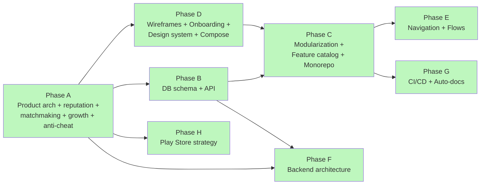
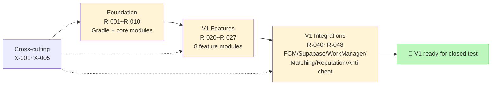
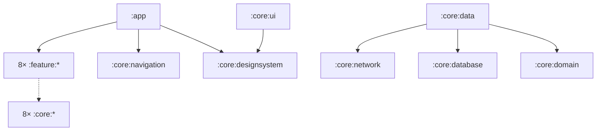
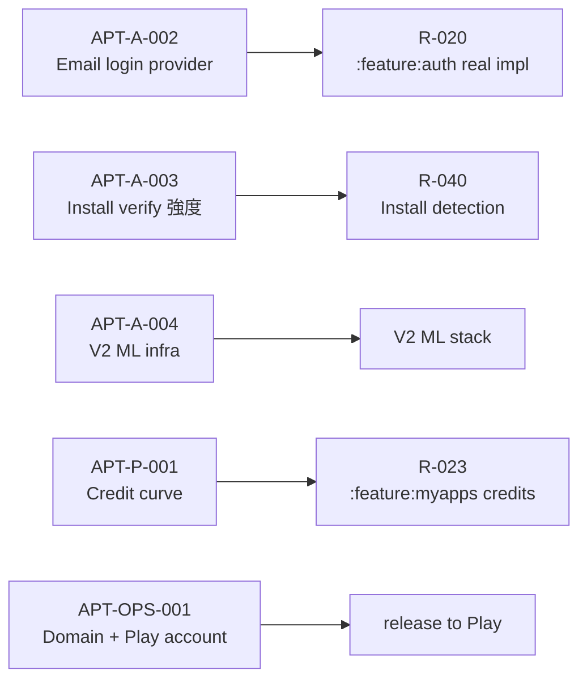

# AppTest — Dependency graphs

> 30-second status read. 4 圖：architecture phase flow / build phase flow / module DAG / owner-blocker fan-out。

---

## 1. Architecture phase flow (2026-05-19 全部完成)



24 個 spec 全 `status: done`，全 ≤ 200 行。

## 2. V1 build phase flow (架構後的工程實作)



部分 R-001~R-010 已在 2026-05-19 動工（Gradle root + `:core:common` + `:core:domain` + 部分 `:core:designsystem`），完整 scaffold 等下一個 session 接手。

## 3. Module DAG (簡化版 — 完整見 `modularization.md §2`)



**規則：** feature 不能 import feature；core 不能 import feature。詳見 [`modularization.md`](../modularization.md) §3。

## 4. Critical path to "first runnable demo APK"

```mermaid
flowchart LR
    R001[R-001<br/>Gradle root ✓] --> R003[R-003<br/>:core:common ✓]
    R003 --> R002[R-002<br/>:core:designsystem]
    R003 --> R005[R-005<br/>:core:domain ✓]
    R002 --> R004[R-004<br/>:core:ui]
    R003 --> R009[R-009<br/>:core:navigation]
    R005 --> R010[R-010<br/>:app + NavHost]
    R004 --> R010
    R009 --> R010
    R002 --> R010
    R010 --> R022[R-022<br/>:feature:home<br/>(FakeRepo)]
    R022 --> RUN[🎯 First demo APK<br/>home feed with mock data]
    style R001 fill:#bef7be
    style R003 fill:#bef7be
    style R005 fill:#bef7be
    style RUN fill:#ffe09e
```

✓ = 2026-05-19 已完成的步驟。剩 ~6 步驟 (R-002 / R-004 / R-009 / R-010 / R-022) 可達第一個 runnable APK。

## 5. Owner-blocker fan-out (剩 6 個未決)



APT-A-001 (backend platform) **已 resolved** 2026-05-19 → Firebase + Supabase + Ktor。

## 6. Quick-query commands

```bash
# 下一個 unblocked task (architecture done → 工程 R-* tasks)
grep -B1 "status: not_started" _specs/_ai/manifest.yaml | grep "APT-V1-R-" | head -10

# 看 V1 features 進度
grep -E "id: APT-V1-R-" _specs/_ai/manifest.yaml

# 看 owner 待決
grep -A1 "^  - { id: APT-[AP]-" _specs/_ai/manifest.yaml

# 找 spec by topic
grep "topic:" _specs/_ai/manifest.yaml | head -20

# 確認檔案行數合規 (應 ≤ 200)
wc -l _specs/*.md | sort -n | tail -5
```

## 7. 各 phase 文件密度 (供 token budget 預估)

| Phase | Files | Lines | Avg |
|---|---:|---:|---:|
| A (product) | 6 | 769 | 128 |
| B (data/API) | 3 | 443 | 148 |
| C (modules) | 3 | 534 | 178 |
| D (UI) | 6 | 974 | 162 |
| E (flows) | 2 | 390 | 195 |
| F (backend) | 1 | 180 | 180 |
| G (ops) | 2 | 292 | 146 |
| H (launch) | 1 | 165 | 165 |
| AI layer | 4 (incl. manifest) | 616 | 154 |
| **Total** | **28** | **4363** | **156** |

冷啟動載 `_ai/README.md` + `_ai/manifest.yaml` + 1~2 個 spec ≈ 15~25k tokens（vs 載全 28 個 ≈ 110k）。
