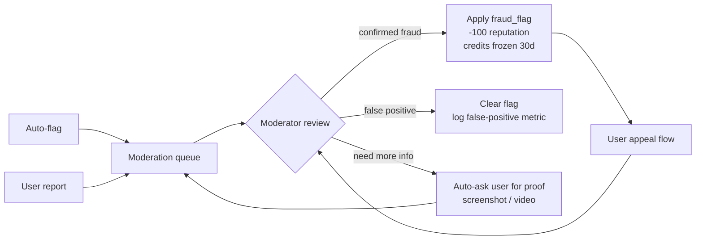

# AppTest — Anti-Cheat & Trust

> **Version:** 0.1 · **Last updated:** 2026-05-19 · **Owner:** TBD · **Pillar:** Trust
> 第一次重大作弊事件 = 信任崩塌。把反作弊當 P0，不是 P3 backlog item。

---

## 1. Threat model (V1)

| Threat | Attacker payoff | Detection difficulty | V1 ship? |
|---|---|---|---|
| **Sybil:** 多帳號互相配對刷完成 | 拉高自己 reputation + 補滿 App tester | Medium | ✓ |
| **Phantom install:** 點「已安裝」但實際沒裝 | 賺 credits 不費力 | Low (PackageManager 可驗) | ✓ |
| **Early abandon:** 中途解除安裝但宣稱還在 | 同上 | Low (heartbeat 抓) | ✓ |
| **Collusion ring:** 小團體互相套利 | 系統性刷高 reputation + 補配額 | High (graph anomaly) | partial (heuristic only) |
| **Bot account:** 自動化腳本操作 | 大規模 sybil 升級版 | High | partial |
| **Tester abuse from owner side:** 假 App 騙 tester 浪費時間 | 詐騙 / 惡意 | Medium (community report) | ✓ |
| **Reputation defamation:** 故意棄測拉低對方分 | 競爭打擊 | N/A (abandon 只扣自己分) | ✓ design 解決 |
| **APK side-load attack:** 上傳惡意 APK | malware 散布 | Hard PREVENT (架構解決) | ✓ design 解決 |

## 2. Architectural defenses (built-in, V1)

| Defense | 防的 threat | 實作 |
|---|---|---|
| **只走 Play Store closed test URL** | APK side-load / malware | hard rule §5 of product_architecture |
| **Heartbeat from PackageManager** | Phantom install / Early abandon | WorkManager daily check |
| **Abandon 只扣自己分** | Reputation defamation | reputation 公式設計 |
| **單帳號最多 5 個並行 TestRequest** | Bot / sybil 規模 | API 強制 |
| **同裝置 Android ID 雜湊 24h 限 1 配對** | Sybil 集中裝置 | matching service 過濾 |

## 3. V1 detection (heuristics, runs nightly)

### 3.1 Sybil detection
```
FOR each user u:
  collusion_score = max over user-group G containing u of:
    edges_in_G / max_possible_edges(|G|)
    AND |G| ≥ 4
    AND avg_completion_time_in_G < global_avg * 0.6
  IF collusion_score > 0.7: FLAG for review
```
- **Edge** = user X 完成過 user Y 的 App，或反過來。
- **Cluster threshold:** ≥ 4 人，互相重疊度 > 70% → 進審查隊列。

### 3.2 Phantom install
```
FOR each TestRequest with status=installed but no heartbeat ping in 48h:
  AUTO-DEMOTE to status=abandoned (after 24h grace + user notification)
```

### 3.3 Bot pattern
- **同一 IP / device fingerprint** 一週內 ≥ 5 個新帳號 → flag。
- **完成時間 too uniform:** 多個 TestRequest 完成時間秒數差 < 60s → flag (人不可能精準到秒)。
- **No app launch events:** 14 天 heartbeat 都通過但 zero app launch event → flag (僅安裝沒開過)。

### 3.4 Malicious App owner
- 同 owner 連 ≥ 3 個 tester 主動 report → 自動 pause App + 進人工審查。
- App descriptions 用 LLM moderation API 過濾 (Phase D 內接) — V1 用 Firebase Cloud Functions 接 OpenAI moderation endpoint。

## 4. V2 — ML-based detection

| Model | Input | Output |
|---|---|---|
| **Sybil ring detector** | User-App bipartite graph (last 90d) | Per-user collusion risk score 0~1 |
| **Bot classifier** | Sequence of events (login / install / heartbeat / launch timing) | Binary prob bot |
| **Fraud anomaly** | Multi-dimensional behavior vector | Anomaly score (Isolation Forest) |

V2 啟用前需累積 ≥ 6 個月真實事件資料 + ≥ 200 confirmed fraud cases for supervised training。

## 5. Moderation flow



**SLA:** 進 queue 後 ≤ 72h review。Appeals ≤ 7d 回覆。

## 6. False-positive handling

反作弊**只能傷可挽回的東西**。V1 處罰梯度：
1. **First flag (low confidence):** 警告 + 暫時降配對權重，無分數變動。
2. **Confirmed first offense:** -100 reputation + credits freeze 30d。可申訴。
3. **Repeat:** 帳號 ban (但 email + Google account 進 deny list，避免換 email 重來)。

**永遠不做：** 不公開「user X 被判作弊」。隱私 + 反 vigilante harassment。

## 7. Transparency

對使用者公開 **what** 不公開 **how**：
- Help center 有頁「我們如何防止作弊」(高層說明，不講閾值)
- 任何處罰附**人類可讀理由**：「您 7 天內接 12 個任務但只完成 1 個，違反 X 條」
- 申訴有人工窗口

## 8. Owner-side abuse (often forgotten)

| Owner attack | V1 對策 |
|---|---|
| 發完 App 立刻 paused，騙 tester 時間 | App 一旦進 `recruiting` 24h 內不可 paused 給 owner |
| 假 Play opt-in URL (連到別處) | API 驗 URL host = `play.google.com` + 試解 packageName 一致 |
| 重複貼同 App 不同 packageName | packageName 全平台 unique |
| 賺 reputation 後翻臉拒測 tester | tester 一旦 matched → owner 無法移除（必須 owner cancel App 整個任務） |

## 9. API surface (moderation)

| Method | Path | Auth |
|---|---|---|
| `POST` | `/me/reports` | user → 檢舉某 user / App / TestRequest |
| `GET` | `/internal/moderation/queue` | mod-only |
| `POST` | `/internal/moderation/decisions/:id` | mod-only |
| `POST` | `/me/appeals` | flagged user 提申訴 |
| `GET` | `/me/appeals/:id` | 看申訴狀態 |

## 10. Metrics & reporting

| Metric | Target |
|---|---|
| Confirmed fraud / total TestRequests | ≤ 1.5% (V1) / ≤ 0.5% (V2) |
| False positive rate (申訴翻案率) | ≤ 5% |
| Mean time to detect (auto-flag to confirmed) | ≤ 72h |
| Sybil ring size detected per month | trend down |
| Tester→App report rate | trend down (signal of platform health) |

## 11. Open decisions

| ID | Decision | Status |
|---|---|---|
| APT-A-003 | V1 是否強制 Play Integrity | draft: V1 optional, V2 mandatory |
| APT-P-012 | Confirmed fraud 是否公開（隱去身份的）案例月報 | default: 公開 aggregated stats only |
| APT-OPS-002 | 第三方 moderator 服務 vs 自有人力 | open: V1 自有 1 人即可 |
