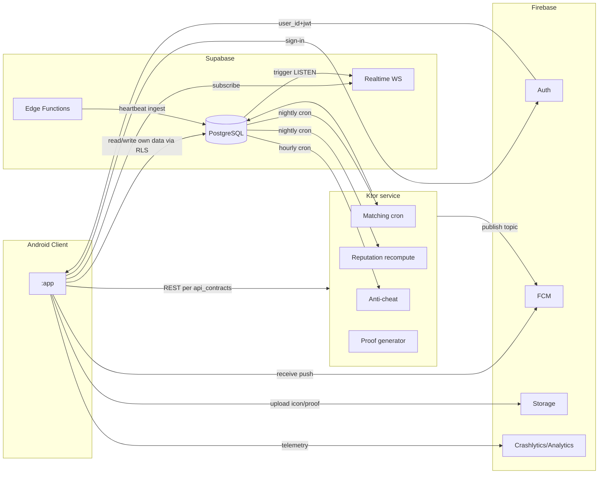

# AppTest — Backend Architecture

> **Version:** 0.1 · **Last updated:** 2026-05-19 · **Owner:** TBD
> 後端三組件邊界 + 資料流 + 可觀測性 + 部署拓樸。Schema 見 `database_schema.md`，API 見 `api_contracts.md`，sequence 見 `testing_exchange_flow.md`。

---

## 1. Service boundaries (APT-A-001 resolved → 3 組件)

| Service | Responsibility | Owns data? |
|---|---|---|
| **Firebase** | Auth providers (Google), FCM push, Cloud Storage (icons, screenshots, proof images), Crashlytics, Analytics | no — only Auth user records (mirrored to Supabase) |
| **Supabase** | PostgreSQL primary store (all tables per `database_schema.md`), Realtime WebSocket, Storage backup (optional), Edge Functions (thin endpoints) | **yes** — all business data |
| **Ktor service** | Matching cron, reputation recompute, anti-cheat heuristics, proof card generator | no — stateless; reads/writes Supabase |

**No alternatives in V1.** 不上 Cloud Run / Lambda / 自管 PG — 那是 V3 規模化才考慮的事。

## 2. Data flow

## 3. Why this split?

| Concern | Why this owner |
|---|---|
| Auth | Firebase 最成熟、Android SDK 完整、零維護 |
| Push | FCM 是 Android 原生，無替代 |
| 主資料庫 | Supabase = PG + RLS + Realtime 三合一，少維護一層 |
| 自訂業務邏輯（matching） | Ktor 給最大彈性 + 可帶 ML 推論 (V2) |
| 檔案存儲 | Firebase Storage 與 Auth/FCM 同生態，省 IAM |

**Anti-pattern (拒絕)：** 把 matching 邏輯塞進 Supabase Edge Function — 邏輯複雜度 + 之後 V2 ML 推論 = 不適合 short-running edge。Ktor 才能跑長任務 + 持 state。

## 4. Synchronous vs async paths

| Path | Sync / Async | Latency budget |
|---|---|---|
| Sign-in (auth) | sync | ≤ 1.5s |
| Read API (`GET /apps/:id`) | sync | p95 ≤ 200ms |
| Write API (`POST /apps`) | sync | p95 ≤ 500ms |
| Heartbeat ingest | sync, idempotent | p95 ≤ 100ms (Edge Function) |
| Matching batch | async (cron) | 02:00 UTC, wall clock ≤ 60s for 10k users |
| Reputation recompute | async (cron) | 03:00 UTC, wall clock ≤ 5min |
| Anti-cheat heuristic | async (cron) | hourly, wall clock ≤ 2min |
| Push delivery | fire-and-forget | best-effort |
| Proof card generation | sync on demand | ≤ 2s, cache 30d |

## 5. WebSocket strategy

- 用 Supabase Realtime（基於 Phoenix Channels）— 不自管 WebSocket server
- 客戶端 JWT 訂閱，RLS 自動套用過濾
- 4 個 channel (詳 `api_contracts.md §10`)：profiles:me / test_requests:me / apps:owned / notifications:me
- Failure fallback: client 60s poll
- Connection budget: 每 user 1 connection × 4 channel subscription

## 6. Storage layout

| Bucket | Public? | Lifecycle |
|---|---|---|
| `app-icons/{appId}/icon.png` | public read | upload on `POST /apps`，update 時版本化路徑 |
| `app-screenshots/{appId}/{n}.jpg` | public read | 同上 |
| `user-photos/{userId}/avatar.jpg` | public read | profile 改照片重寫 |
| `proofs/{proofId}.png` | public read | 30d cache，背後 verify URL signed |
| `internal/match-runs/{runId}.jsonl` | service-only | audit log, 180d |

Path conventions allow CDN caching by URL (immutable per version)。

## 7. Secrets management

| Secret | Location | Rotation |
|---|---|---|
| Supabase `anon_key` | `app/local.properties` → `BuildConfig` | rare |
| Supabase `service_role_key` | Ktor env var; Edge Function secret | quarterly |
| Firebase Admin JSON | Ktor `/etc/secrets/firebase.json` (k8s secret) | annual |
| FCM Server Key | Firebase Admin (no separate key) | n/a |
| OpenAI / LLM keys (V2) | Ktor env var | monthly |
| Signing keystore | CI secret (GitHub Actions) | never (Play app signing) |

**禁止** 在 Android client 持任何 service_role / admin / signing key。

## 8. Observability

| Signal | Tool | Retention |
|---|---|---|
| Client crashes | Firebase Crashlytics | 90d free tier |
| Client analytics | Firebase Analytics → BigQuery export | indefinite |
| Backend logs | Ktor → JSON stdout → log collector (TBD: Grafana Loki vs Datadog) | 30d |
| Backend metrics | Prometheus (Ktor exposes /metrics) | 30d |
| Backend traces | OpenTelemetry → Jaeger / Honeycomb | 7d |
| Supabase logs | built-in dashboard | 7d free, longer paid |
| Cron job results | DB table `match_runs.metrics` + alert if missed schedule | indefinite |

Critical alerts (PagerDuty / on-call):
- Matching cron missed schedule > 1 cycle
- API error rate > 1%/5min
- WebSocket connection drop rate > 10%/5min
- Auth failure rate > 5%/5min
- Fraud flags spike (anomaly detector for the detector)

## 9. Deployment topology

| Component | Where | Why |
|---|---|---|
| Firebase | Google Cloud (asia-northeast1 default) | 主要 TW/JP/SG audience |
| Supabase | hosted (asia-northeast1) | 同上；avoid 跨 region latency |
| Ktor | Cloud Run (asia-northeast1)，min instance 1, max 10 | server-side scaling 自動，stateless |
| Cron triggers | Supabase scheduled functions (cron syntax) → POST Ktor endpoint | 不自管 cron infra |

V3 全球網路：考慮多 region Ktor + Supabase read replicas（不在 V1 範圍）。

## 10. Disaster recovery

| Scenario | RPO | RTO | Plan |
|---|---|---|---|
| Supabase regional outage | 24h (daily snapshot) | 6h | snapshot restore in alt region |
| Ktor instance crash | 0 (stateless) | < 1min | Cloud Run auto-restart |
| FCM outage | n/a (Google SLA) | n/a | fallback to WebSocket realtime |
| Matching cron failure | 24h | next cycle | manual trigger via `/internal/match/runs/dry-run` then real |
| DB schema migration broken | n/a | < 30min | rollback migration + restore from snapshot if data corrupted |

## 11. Cost guardrails (V1 budget ~$50/month soft cap)

| Service | Free tier coverage | Watch metric |
|---|---|---|
| Firebase Auth | 50k MAU free | MAU |
| FCM | unlimited free | n/a |
| Firebase Storage | 5GB free | total bucket size |
| Supabase | free tier ≤ 500MB DB + 1GB storage | DB size, egress |
| Ktor on Cloud Run | min instance 1 = ~$15/mo | requests/s |
| LLM (V2) | n/a | tokens/day budget cap |

每月自動 cost alert at 80% budget。

## 12. Open decisions

| ID | Decision | Status |
|---|---|---|
| APT-A-018 | Logging vendor (Loki vs Datadog vs nothing in V1) | default: V1 用 Supabase logs + Crashlytics 即可 |
| APT-A-019 | Ktor 部署平台 (Cloud Run vs Fly.io vs Render) | default: Cloud Run（同 region, Firebase 整合好） |
| APT-A-020 | Supabase free tier 撐到多少 user 升級 | trigger: DB > 400MB |
