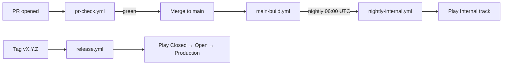

# AppTest — CI/CD Architecture

> **Version:** 0.1 · **Last updated:** 2026-05-19 · **Owner:** TBD
> GitHub Actions pipelines + Play Store track strategy + signing + release process。
> Per-module test 策略見 `modularization.md §6`，docs lint 見 `auto_docs.md`。

---

## 1. Pipeline overview



4 workflows，皆在 `.github/workflows/`。

## 2. Workflow: pr-check.yml (every PR)

| Job | Steps | Time budget |
|---|---|---|
| `assemble` | `./gradlew assembleDebug` | ≤ 5 min |
| `unit-test` | `./gradlew testDebugUnitTest` (parallel per module) | ≤ 8 min |
| `lint` | `./gradlew lintDebug detekt ktlintCheck` | ≤ 3 min |
| `screenshot-test` | `./gradlew verifyPaparazzi` (only `:core:ui` + designsystem) | ≤ 4 min |
| `docs-lint` | custom script: each module has README/API/FLOW/DEPENDENCY | ≤ 1 min |
| `200-line-lint` | custom script: `find -name '*.kt' \| awk 'length > 200'` | ≤ 1 min |

All jobs run **in parallel**; PR cannot merge until all green。

### Critical config
- Concurrency: same PR cancel-in-progress
- Cache: Gradle cache (actions/cache@v4) keyed by `gradle/libs.versions.toml` hash
- Matrix: API 28 + API 34 emulator for instrumented tests (only on `main` + nightly)

## 3. Workflow: main-build.yml (every push to main)

- Same as PR check **plus**: 
  - `./gradlew assembleRelease` (no signing, smoke)
  - Bundle artifact upload (for inspection)
  - Coverage report (Jacoco aggregated)
- Time budget: ≤ 15 min

## 4. Workflow: nightly-internal.yml (cron 06:00 UTC daily)

| Step | Purpose |
|---|---|
| `assembleRelease` + sign with release keystore | Produce signed AAB |
| Upload to Play Console Internal track | `r0adkll/upload-google-play@v1` |
| `connectedAndroidTest` on Firebase Test Lab | full instrumented test on 5 device profiles |
| Notify Slack #builds | success / failure summary |

Internal testers (僅 team) 拿到自動 24h 內最新版。

## 5. Workflow: release.yml (manual trigger on tag)

```bash
git tag v1.0.3
git push origin v1.0.3   # triggers workflow
```

Steps:
1. Verify tag matches `vX.Y.Z` semver
2. Generate `versionCode` from tag + commit count
3. Build signed AAB + APK universal
4. Generate release notes from Conventional Commits since last tag
5. **Promotion gate** (manual approval in GitHub UI):
   - Closed → wait for promotion
   - Open → wait for promotion
   - Production → wait for promotion + rollout %
6. Upload to selected Play track via API
7. Tag Crashlytics release for grouping
8. Post release notes to Slack #releases

## 6. Play Store track strategy

| Track | Who tests | When | Rollout |
|---|---|---|---|
| **Internal** | Team (≤ 100) | every night auto | 100% immediately |
| **Closed (beta)** | Trusted beta list (≤ 1k) | manual promote (weekly?) | 100% |
| **Open** | Anyone signed up via link | manual (post-MVP) | gradual: 1% → 5% → 25% → 100% |
| **Production** | Public | manual (post-stable) | 1% → 5% → 25% → 100% over 7 days |

For V1 launch: 走 Internal → Closed → Production (skip Open，因為 AppTest 本身就是「找 beta tester 的工具」，open beta 沒太大意義)。

## 7. Versioning

- `versionName` = `vX.Y.Z` semver (matches git tag)
- `versionCode` = `(major × 10000) + (minor × 100) + patch` + 1 (e.g. v1.2.3 → 10203)
- Auto-bumped per CI release run; manually set in `gradle.properties` for dev

### Tag types
- `v1.0.0` → Production release
- `v1.1.0-beta.1` → Closed beta
- `v1.1.0-rc.1` → Production candidate (gradual rollout)

## 8. Signing & keys

- **Play App Signing** enabled (Google manages signing key) — recommended
- Upload key: generated once, stored in CI secret `UPLOAD_KEYSTORE_BASE64` + `UPLOAD_KEYSTORE_PASSWORD`
- Local dev: each developer has own debug keystore (auto-generated by Studio)
- **Never** commit any `.jks` / `.keystore` to repo (gitignore enforced)

Rotation: 若 upload key 洩漏 → Google support 換鑰，App signing key 不受影響。

## 9. Test strategy in CI

| Test layer | When run | Pass criteria |
|---|---|---|
| Unit (pure JVM) | every PR | 100% pass |
| Unit (Compose UI test) | every PR | 100% pass |
| Screenshot test (Paparazzi) | every PR | pixel diff < threshold; new screenshots require approval |
| Instrumented (Hilt + DB + Network mock) | every PR | 100% pass |
| Instrumented (Firebase Test Lab, real device) | nightly | 95% pass (flake budget) |
| E2E happy-path | nightly | full F1+F2+F3 flows green |

Total CI cost: monitor monthly, target ≤ $50/month for V1 (mostly free tier)。

## 10. Quality gates

PR cannot merge unless:
- ✅ All `pr-check.yml` jobs green
- ✅ Code review approval ≥ 1 (V1; V2 raise to 2 once team grows)
- ✅ No file > 200 lines (200-line-lint)
- ✅ All affected modules have updated 4-docs (docs-lint)
- ✅ No console.log / println unguarded by debug build
- ✅ No `TODO` without linked issue id

## 11. Dependency updates

- **Renovate** runs weekly (or daily for security)
- Auto-merge minor + patch for non-Compose, non-AGP, non-Kotlin (test-only changes)
- Manual review required for: AGP, Kotlin, Compose BOM, Hilt, Room, Supabase SDK
- Bot opens PR titled `[deps] bump X from a.b.c to a.b.d`

## 12. Rollback

| Issue | Path |
|---|---|
| Bad release in Production (rollout < 25%) | Play Console: halt rollout |
| Bad release in Production (≥ 25%) | Submit fix patch ASAP; no Play Console rollback |
| Schema migration broken | DB migration rollback script (see `monorepo.md` migrations) |
| Backend API regression | revert Ktor deployment (Cloud Run keeps last 5) |

Each release tag in CI saves: signed AAB + mapping.txt + commit SHA → easy to compare what's in prod。

## 13. Open decisions

| ID | Decision | Status |
|---|---|---|
| APT-OPS-004 | CI provider (GH Actions vs CircleCI vs Bitrise) | default: GH Actions (same repo, free for OSS) |
| APT-OPS-005 | Firebase Test Lab quota (free tier limits) | monitor; upgrade if >150 test/day |
| APT-OPS-006 | 是否引入 Bundle Analyzer 跟 APK size | default: V1 後加，track AAB size budget |
