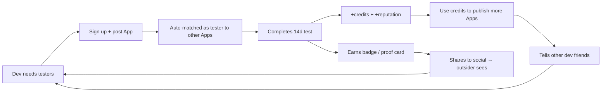

# AppTest — Growth Loops & Network Effect

> **Version:** 0.1 · **Last updated:** 2026-05-19 · **Owner:** TBD · **Pillar:** Network Effect
> 為什麼「N + 1 個用戶」會讓現有 N 個用戶都受益。Viral coefficient 設計 + acquisition 策略。

---

## 1. Network effect taxonomy

AppTest 是 **同邊 (one-sided) 網路** — 同類用戶（developers）之間互相提供價值。比雙邊 marketplace 更難冷啟，但一旦過閾值更難被取代。

**強度層級** (Reid Hoffman framework)：
- **Direct same-side:** 越多 dev → 任一 dev 越快補滿 12 testers ✓
- **Data NE:** 越多測試紀錄 → AI matchmaking 越準 (V2+) ✓
- **Social NE:** Reputation 公開 → 信用變可攜 (V2+) ✓
- **Marketplace NE:** ✗ 不適用（沒買賣方）

## 2. Primary growth loop (V1)



**主迴圈 (G):** 完成測試 → 賺到 credits → 更願意推薦 → 朋友加入 → 自己池子變大。
**輔助迴圈 (I):** 完成證明可截圖分享 → outsider 看到 organic 訊號 → 加入。

## 3. Viral coefficient (K-factor) model

```
K = invites_sent_per_user × conversion_rate
```

V1 目標 K = 0.6（不需病毒，但要 retention 強）；V2 目標 K = 1.0（自我增長閾值）。

### 3.1 V1 invite levers
| Mechanism | invites/user | conversion |
|---|---|---|
| 完成測試後的「分享證明卡」CTA (organic, no incentive) | 0.5 | 12% |
| Profile 上的 referral link (passive) | 0.3 | 8% |
| In-app「邀請開發者朋友」(active push 1 次) | 0.4 | 20% |
| **Sum (V1)** | 1.2 | ~13% blended → **K ≈ 0.15** |

V1 預期 K ≈ 0.15 — 不夠自我增長。**前 6 個月需要外部 seed**（見 §6）。

### 3.2 V2 加成
- AI 摘要報告做成「Beta tester insights」分享卡片 → invites +0.4
- Reputation tier 升級慶祝可分享 → +0.2
- 預期 K → 0.4~0.6

### 3.3 V3 加成
- 團隊測試 (team invite) → 加入即綁全團隊 → +0.6 amplifier
- Subscription Pro 解鎖「邀請即得回饋」(雙邊獎勵，但不犧牲 hard rule §1) → +0.3
- 預期 K ≥ 1.0

## 4. Activation funnel (V1 critical)

```
Visit landing  → 100%
↓ (CTR 25%)
App download   → 25%
↓ (signup 70%)
Sign up        → 17.5%
↓ (post App OR opt-in tester 60%)
First action   → 10.5%
↓ (first match within 24h 80%)
First match    → 8.4%
↓ (install Play opt-in URL 70%)
First install  → 5.9%
↓ (heartbeat day 1 60%)
Day-1 retain   → 3.5%
↓ (complete 14d 65%)
Activated      → 2.3%
```

**Drop-off 重災區** (V1 必修補):
1. `Sign up → First action` (30% drop) — Onboarding 設計關鍵，見 `onboarding_ux.md`。
2. `First match → First install` (30% drop) — Push 通知文案 + Play deep-link 體驗。
3. `Install → Day 1 heartbeat` (40% drop) — WorkManager 必須真的跑；Doze mode 對策。

## 5. Reciprocity loop (credits as social contract)

Credits 不是貨幣 — 是「我為網路付出 N 單位 → 網路為我回饋 N 單位」的社會契約 token。

| 動作 | Δ credits | Δ reputation |
|---|---|---|
| 註冊 | +1 (首 App 免費 slot) | baseline 300 |
| 完成 1 次測試 (14d) | +1 | +6~12 (依公式) |
| 中途棄測 | 0 | -10~30 |
| 發佈 1 個新 App (扣 slot) | -1 | +0~5 (publish_score) |
| Fraud 確認 | 全 credits 凍結 30d | -100 |

**設計準則：** 永遠維持「先付出後享受」的順序。新人首 App 免費 = 唯一例外，且只能 1 次。

## 6. Cold-start strategy (chicken-and-egg)

V1 預期 K=0.15 → **必須手動 seed**。

### 6.1 種子用戶獲取 (前 100 個 dev)
| Channel | 預期人數 | 成本 | 觸發 |
|---|---|---|---|
| 個人 dev 圈邀請 (Telegram / Discord) | 20 | $0 | week 0 |
| Reddit r/androiddev pre-launch post | 30 | $0 | week 1 |
| Twitter / X dev community | 20 | $0 | week 2 |
| Product Hunt launch | 30 | low | week 4 |
| Hacker News show | 10~50 | $0 | week 6 |

### 6.2 種子規則
- 前 100 人手動審核（避免一開始就被作弊污染訊號）
- 預先 seed 10 個「示範 App」(team 自己貼)，確保新人一進來就有可配對對象
- 啟動前 30 天免費送 5 credits/人，週期過後恢復標準

## 7. Network density milestones

| Milestone | Density 指標 | Why it matters |
|---|---|---|
| 100 dev | 90% Apps 在 7d 內被配對成功 | 證明 unit economics |
| 500 dev | K-factor 量測穩定 | 開始可信 marketing 預算 |
| 1k dev | Time-to-12 ≤ 14d | 達 product-market fit |
| 5k dev | 跨類別冷啟 < 3d | V2 ML 訓練資料夠 |
| 10k dev | 自然搜尋成主流量源 | 達網路效應自我循環 |

## 8. Retention design (V1)

- **D1:** Push notification 推「你的 App 已收到第一個配對 tester」(製造當天成就感)
- **D7:** In-app inbox 顯示「本週你已貢獻 N 天測試」(visible progress)
- **D14:** 完成第一次測試 → 觸發升級動畫 + 證明卡 + 邀請朋友 CTA
- **D30:** 寄 email summary：本月你幫助了 N 個 dev，你的 App 進度 X/12

## 9. Anti-growth-at-all-costs guardrails

避免成長壓力扭曲產品決策：
1. **不引入** dark pattern（強制邀請才能用、訂閱前不告知功能等）
2. **不買** push notification spam channel
3. **不混淆**自然成長與付費成長報表（內部 dashboard 分開）
4. **每月** review acquisition channel 是否帶 toxic users (低完成率 / 高 fraud rate)

## 10. Measurement

| Metric | Tool | Cadence |
|---|---|---|
| K-factor / cohort retention | 自建 (PostgreSQL queries on event log) | weekly |
| Funnel | Firebase Analytics + custom events | daily |
| NPS | in-app 1-tap 投票 (push 28d 後) | continuous |
| Quality-weighted growth | DAU × avg reputation | weekly |
