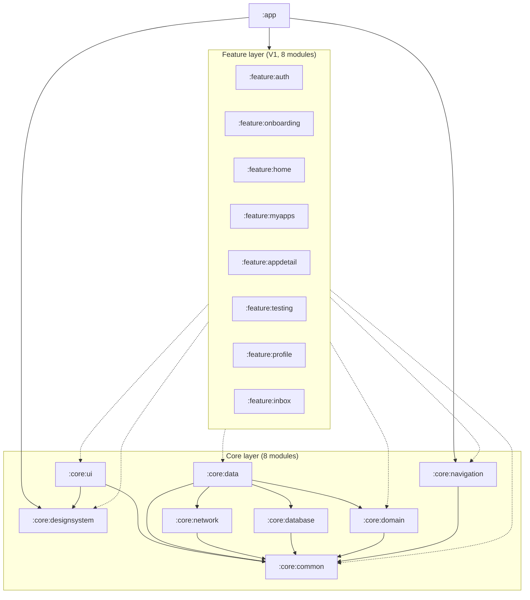

# AppTest — Modularization Map

> **Version:** 0.1 · **Last updated:** 2026-05-19 · **Owner:** TBD
> Module DAG + layer rules + 替換策略。Feature module 內部結構見 `feature_modules.md`，Gradle / monorepo 規範見 `monorepo.md`。

---

## 1. Module taxonomy

```
:app                    -- Hilt App + MainActivity + NavHost (端點，無業務邏輯)
:core:*                 -- 共用基礎建設 (8 個)
:feature:*              -- 業務功能 (V1 8 個，依需求新增)
```

| Layer | Modules | 規則 |
|---|---|---|
| **app** | `:app` | 只 wire 不寫邏輯；可 depend on 所有 core + feature |
| **feature** | `:feature:*` | 1 feature = 1 user-facing 領域；可 depend on 多個 core，**不可** depend 其他 feature |
| **core** | `:core:*` | 跨 feature 共用基礎；**不可** depend 任何 feature；core 之間有限度依賴 |

## 2. Module DAG (hard rule: no cycles)



虛線表示「典型」依賴 — 個別 feature 不一定全用。例如 `:feature:onboarding` 可能不需 `:core:data`。

## 3. Hard rules (lint-enforced)

1. **No feature → feature import.** Cross-feature 跳轉走 `:core:navigation` Destination contract。
2. **No core → feature import.** 任何 core 模組 grep `import com.apptest.feature` 必須回空。
3. **No cycles.** `gradle --scan` + `dependency-analysis` plugin 偵測。
4. **One module = one namespace prefix.** `:feature:home` → `com.apptest.feature.home.*`。
5. **`:app` 模組 ≤ 30 個 source file.** 超過 = 業務邏輯漏進 app，要往 feature 推。
6. **Public API minimization.** 預設 `internal`，跨模組才標 `public`。

## 4. Layer rules (within each module)

每個 feature 內部三層 (Clean Architecture)：

```
ui (Composable + ViewModel + UiState)
  ↓ depends on
domain (UseCase + Repository interface)
  ↓ depends on
data (Repository impl + Mapper + DTO + Local/Remote DataSource)
```

- **UI 不可直接呼叫 Repository** — 必須透過 UseCase。
- **ViewModel 不可 import Android UI types** (View, Context, Activity)。
- **Domain 純 Kotlin** (no Android imports)，可單獨 JVM 測試。
- **Data 可 import Android** (Room, Retrofit, DataStore)。

詳細 per-feature 結構見 `feature_modules.md §3`。

## 5. Replacement strategy (how to swap impl)

每個 core 模組對外只 expose **interface**，內部 Hilt module bind default impl。替換方式：

```kotlin
// :core:network/src/main/.../NetworkModule.kt (default)
@Module @InstallIn(SingletonComponent::class)
abstract class NetworkModule {
  @Binds abstract fun bindApiClient(impl: RetrofitApiClient): ApiClient
}

// :app/src/debug/.../FakeNetworkModule.kt (override in debug build variant)
@Module @InstallIn(SingletonComponent::class)
@TestInstallIn(components = [SingletonComponent::class], replaces = [NetworkModule::class])
abstract class FakeNetworkModule { ... }
```

| Replace target | 用例 |
|---|---|
| `:core:network` impl | `FakeApiClient` for offline dev + UI test |
| `:core:database` impl | `InMemoryDb` for unit test |
| `:core:designsystem` theme | A/B test theme variant |
| Per-feature `Repository` impl | Stub data while backend WIP |

## 6. Test strategy per module type

| Module type | Test type | Tool |
|---|---|---|
| `:core:common` / `:core:domain` (pure JVM) | unit test, no Android | JUnit + Truth + MockK |
| `:core:database` | Room in-memory test | Roboelectric + Room test util |
| `:core:network` | Retrofit + MockWebServer | OkHttp MockWebServer |
| `:core:ui` / `:core:designsystem` | Compose UI test + screenshot | createComposeRule + Paparazzi |
| `:feature:*` | layer-mixed | JUnit (domain/data) + Compose UI test (ui) |
| `:app` | smoke instrumented test | UiAutomator + Hilt-android-testing |

CI gates per module type — 詳 `cicd.md`。

## 7. Versioning

- All modules share single `versionName` / `versionCode` from `:app`。
- 不做 per-module Maven publish (此專案無外部 SDK 用途)。
- Renaming a module = breaking change，需走 `[BREAKING]` PR + 全 import 修正。

## 8. Naming conventions

| Type | Convention | Example |
|---|---|---|
| Module dir | `lowercase` | `core/designsystem` |
| Gradle path | `:lower:case` | `:core:designsystem` |
| Kotlin package | `com.apptest.<layer>.<name>` | `com.apptest.core.designsystem` |
| Public class | `App` prefix for design-system atoms; no prefix elsewhere | `AppButton`, `HomeViewModel` |
| Internal class | no prefix | `RetrofitApiClient` |
| Feature module | singular noun | `:feature:home`, not `:feature:homes` |

## 9. Build performance hints

- Enable `org.gradle.parallel=true` (set in `gradle.properties` ✓ done)
- Enable `org.gradle.caching=true` (✓ done)
- Enable `org.gradle.configuration-cache=true` (✓ done)
- Use KSP not KAPT (Hilt + Room 都支援 KSP，已用)
- Feature 模組越多，benefit 越大（並行編譯）

## 10. When to split a module further

新建 `:feature:foo:bar` 子模組的觸發條件：
- 父模組 source file 數 ≥ 50
- 父模組 編譯時間 ≥ 30s (incremental)
- 有明確邊界的子領域（如 `:feature:profile:credits` vs `:feature:profile:badges`）

V1 暫不細分；V2 規模化時再評估。

## 11. Anti-patterns (PR reject)

| Anti-pattern | 原因 |
|---|---|
| `:feature:home` import `com.apptest.feature.appdetail.*` | cross-feature dep → 走 nav contract |
| `:core:ui` 注入 ViewModel | layer violation |
| `:app` 寫業務邏輯 | 該到 feature |
| Module with no `README.md` | 違反 4-doc rule |
| Build script ≥ 80 行 | 業務 dep 漏進 build script |

## 12. Open decisions

| ID | Decision | Status |
|---|---|---|
| APT-A-010 | 是否引入 convention plugin 共用 build script | default: V1 不引入（保持每模組可獨立讀） |
| APT-A-011 | `:core:testing` 子模組是否獨立 | default: 是，但 V1 內聯共用 helpers 即可 |
