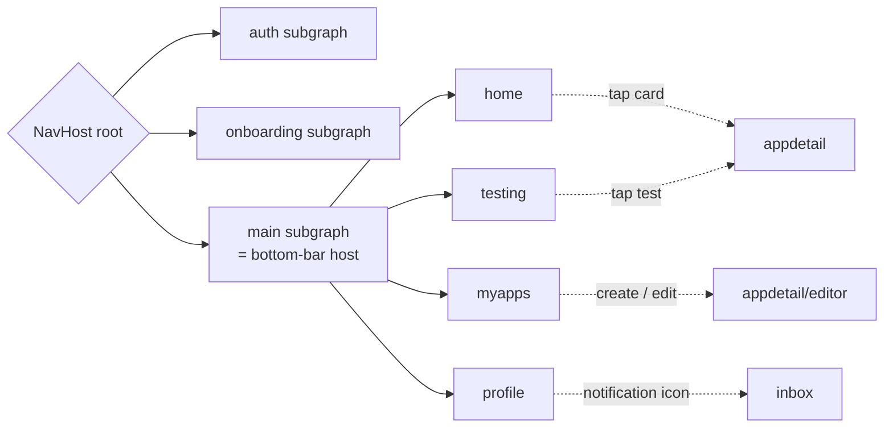

# AppTest — Navigation Architecture

> **Version:** 0.1 · **Last updated:** 2026-05-19 · **Owner:** TBD
> Compose Navigation 2.8+ 型別安全 + 深層連結 + auth gate。
> Per-feature 內部見 `feature_modules.md §2-3`；ARC 順序見 `testing_exchange_flow.md`。

---

## 1. Library + version

- `androidx.navigation:navigation-compose:2.8.5`
- 型別安全用 Kotlin Serializable destinations（不寫字串 route）
- 跨 feature 跳轉走 `:core:navigation` 的 `AppDestination` sealed interface

## 2. Top-level navigation graph



3 個 top-level subgraph：`auth` / `onboarding` / `main`。Auth gate (§5) 決定進哪一個。

## 3. Destination contract (type-safe Compose Navigation)

`:core:navigation` 暴露：

```kotlin
sealed interface AppDestination {
    @Serializable data object AuthRoot : AppDestination
    @Serializable data object OnboardingRoot : AppDestination
    @Serializable data object MainRoot : AppDestination

    // Main subgraph children
    @Serializable data object Home : AppDestination
    @Serializable data object MyApps : AppDestination
    @Serializable data object Testing : AppDestination
    @Serializable data object Profile : AppDestination

    // Pushed on top of main
    @Serializable data class AppDetail(val appId: String) : AppDestination
    @Serializable data class AppEditor(val appId: String? = null) : AppDestination  // null = create
    @Serializable data object Inbox : AppDestination
    @Serializable data object Settings : AppDestination

    // Auth subgraph children
    @Serializable data object SignIn : AppDestination
    @Serializable data class EmailVerify(val email: String) : AppDestination
}
```

每個 feature 也可以自己 expose feature-internal destinations 在 nav/ 子包，但**跨 feature 公開**的都必須在 `AppDestination`。

## 4. NavGraphBuilder pattern

每個 feature 提供 `fun NavGraphBuilder.<feature>Graph(navController, ...)`：

```kotlin
// :feature:home/src/main/.../nav/HomeNavGraph.kt
fun NavGraphBuilder.homeGraph(navController: NavController) {
    composable<AppDestination.Home> { HomeRoute(
        onAppClick = { appId -> navController.navigate(AppDestination.AppDetail(appId)) },
        onInboxClick = { navController.navigate(AppDestination.Inbox) },
    ) }
}
```

`:app` 的 `MainActivity` 在 NavHost 內呼叫所有 graphs：

```kotlin
NavHost(startDestination = AppDestination.AuthRoot, ...) {
    navigation<AppDestination.AuthRoot>(startDestination = AppDestination.SignIn) {
        authGraph(navController, onAuthenticated = { navController.navigate(AppDestination.OnboardingRoot) })
    }
    navigation<AppDestination.OnboardingRoot>(...) { onboardingGraph(...) }
    navigation<AppDestination.MainRoot>(startDestination = AppDestination.Home) {
        homeGraph(navController)
        myAppsGraph(navController)
        testingGraph(navController)
        profileGraph(navController)
        // pushed-on-top sheets
        composable<AppDestination.AppDetail> { ... }
        composable<AppDestination.AppEditor> { ... }
        composable<AppDestination.Inbox> { ... }
    }
}
```

## 5. Auth gate

NavHost `startDestination` 動態決定：

```kotlin
val initial = remember(authState) {
    when (authState) {
        AuthState.SignedOut -> AppDestination.AuthRoot
        AuthState.NeedsOnboarding -> AppDestination.OnboardingRoot
        AuthState.Ready -> AppDestination.MainRoot
    }
}
```

`authState` 由 `:feature:auth/AuthRepository` 提供 `Flow<AuthState>`。Sign-out 時 `popUpTo` 回到 `AuthRoot`。

## 6. Deep links

| Scheme | Pattern | Lands on |
|---|---|---|
| `apptest://app/{id}` | `AppDestination.AppDetail(id)` | 直接打開該 App 詳情 |
| `apptest://test/{id}` | inside `AppDestination.Testing` 該 entry | 從 push 跳「我的測試」當前項 |
| `apptest://verify/{proofId}` | 走 Web fallback (apptest.dev/v/<id>) | 公開驗證頁，不進 App |
| `apptest://invite?ref=<code>` | `AppDestination.AuthRoot` + 記 referrer | growth loop attribution |
| `https://apptest.dev/app/{id}` | App Links (Android verified) | 同 `apptest://app/{id}` |

App Links: `assetlinks.json` 部署在 `apptest.dev/.well-known/assetlinks.json`，Manifest 套 `<data android:host="apptest.dev" ...>`。

## 7. Result passing

Compose Navigation 2.8+ 的 `previousBackStackEntry.savedStateHandle` 傳結果：

```kotlin
// Editor → MyApps 列表「儲存後返回」
navController.previousBackStackEntry?.savedStateHandle?.set("app_created", appId)

// MyApps 觀察
LaunchedEffect(Unit) {
    navController.currentBackStackEntry?.savedStateHandle?.getStateFlow<String?>("app_created", null)
        ?.collect { id -> if (id != null) viewModel.refresh() }
}
```

V1 用內建即可；V2 若 result 變複雜，引入 type-safe Result API 包裝。

## 8. Up / back behavior

| Destination | Up button | Back gesture |
|---|---|---|
| Main subgraph roots (Home/MyApps/Testing/Profile) | 無 up | exit app (clear task) |
| Pushed entries (AppDetail/AppEditor/Inbox) | back to parent | back to parent |
| Auth subgraph | 無 up | exit app（不可 back 到 main）|
| Onboarding subgraph | step 2/3 → 上一步；step 1 → 無 up | 同 up |

`BackHandler` 在 onboarding step 1 + main roots 攔截以 confirm exit。

## 9. Animation

預設過渡（套 design_system motion tokens）：

| Transition type | Animation |
|---|---|
| Forward push (e.g., Home → AppDetail) | slideIn from end + fadeIn(120ms) |
| Backward pop | slideOut to end + fadeOut |
| Tab switch (bottom bar) | crossfade(200ms) |
| Modal-style (Inbox / Settings) | slideIn from bottom |
| Celebration overlay | scale + fade（motionSchemeExpressive，per design_system §6） |

Compose Navigation 2.8+ 提供 `enterTransition` / `exitTransition` lambda per `composable`。

## 10. State preservation

- 每個 main subgraph root 用 `rememberSaveable` 保留 scroll position + filter state
- Bottom-bar tab 切換不重建（NavHost `saveState = true`）
- Process death 復原靠 `SavedStateHandle` in ViewModel

## 11. Forbidden patterns

| Anti-pattern | Why |
|---|---|
| `navController.navigate("home")` 字串 route | 失去型別安全 |
| `Bundle` 傳大型物件 | 應該存 repo / VM，傳 id 就好 |
| Feature 互相 import 對方的 Destination | 違反 module rule，所有公開 nav contract 應在 `:core:navigation` |
| Tab 切換在 `:app` 寫業務邏輯 | 業務邏輯只能在 feature |

## 12. Open decisions

| ID | Decision | Status |
|---|---|---|
| APT-A-016 | App Links host 命名 | default: apptest.dev（與 verify URL 一致） |
| APT-A-017 | 是否引入 Voyager / Decompose 取代官方 Compose Nav | default: 否，stable 即可 |
| APT-P-026 | Sign-out 後 token revocation 是否同步等回 | default: 同步 < 2s timeout，失敗仍 sign-out |
