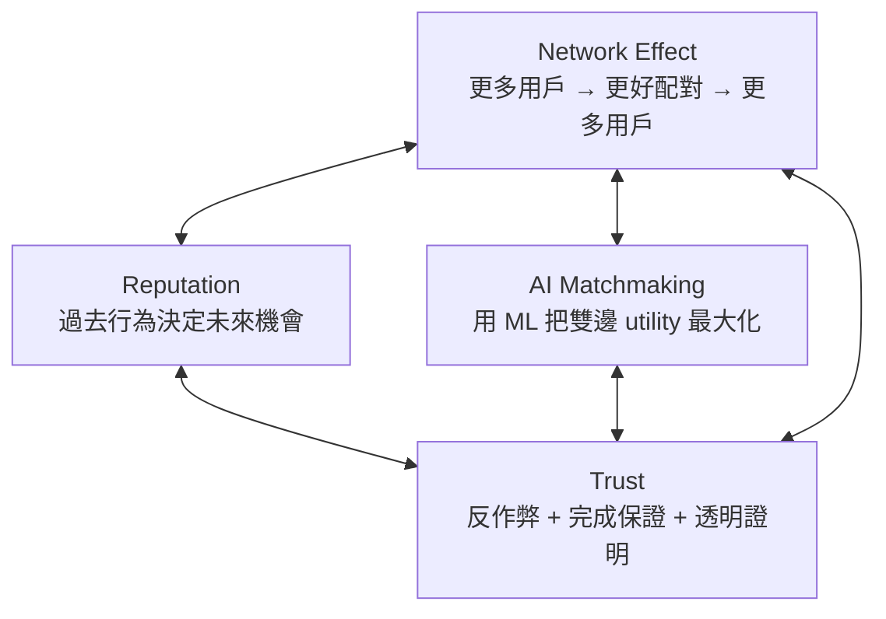
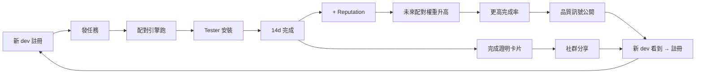

# AppTest — Product Architecture

> **Version:** 0.1 · **Last updated:** 2026-05-19 · **Owner:** TBD
> 產品的「為什麼」與「怎麼搭起來」。Spec scope 見 `mvp.md`；各 pillar deep-dive 見對應檔。

---

## 1. Core thesis

> **AppTest is not a testing utility. It is a Testing Network.**
>
> 工具 (utility) 的價值線性增長：1 個用戶 = 1 個用戶價值。
> 網路 (network) 的價值非線性增長：N 個用戶 = N² 配對機會 × 信任縮放。
>
> 第一原則：**所有設計都必須能 compound**。任何 V1 功能若不能讓 V2/V3 的 leverage 更大，就不該排進 V1。

## 2. Four pillars

| Pillar | 角色 | V1 形態 | V2/V3 升級 | Deep-dive |
|---|---|---|---|---|
| **Network Effect** | 規模驅動力 | 互測即註冊（每加入一個 dev，給其他 dev 多一個 slot） | 跨地域 / 跨類別 fan-out | `growth_and_network.md` |
| **Reputation** | 個人信用 | 4 訊號加權公式 | LLM 自然語言 reputation summary | `reputation_system.md` |
| **AI Matchmaking** | 配對品質 | 6 signal rule-based scoring | embeddings + GBDT ranking | `ai_matchmaking.md` |
| **Trust** | 風險控制 | heuristic + heartbeat + Play Integrity hook | anomaly detection + 影子模式 | `anti_cheat.md` |

## 3. Flywheel — how the four pillars compound

**關鍵 unlock 點：**
- `E → F`：完成測試 = 賺 reputation + credits，把「義務」改造成「投資」
- `I → J`：completion rate 公開 = 把品質訊號變成 acquisition channel
- `K → L`：完成證明卡片可截圖 = 把每個成功案例變成 organic ads

## 4. 2026 vision

> **12 個月內成為「Android 開發者上架前的標配」**
> — 像 Firebase / Crashlytics 一樣，新開 Android 專案的人會自然想到 AppTest。

具體可驗 milestone：
- M3：V1 上線 + 達 500 註冊 dev
- M6：K-factor ≥ 1.0（每個 active user 平均帶來 1 個新註冊）
- M9：V2 AI matchmaking GA，配對品質（completion rate）+30%
- M12：5000 active dev，Pro Subscription 上線（V3）

## 5. Hard product rules (immutable, infinite duration)

1. **Credits 不可購買** (V3 訂閱例外，但訂閱也不能買「位置」，只能買「便利」)
2. **永遠走 Play Store closed test 連結**，禁止 APK / AAB 直傳
3. **任何排序皆不可由付費操縱** (sponsored 廣告也禁，至少 V1~V2)
4. **匿名性 floor**：不對外公開使用者過去測過哪些 App（只公開 aggregate stats）
5. **Reputation 不可重設** (避免 sybil + 刷小帳重來)
6. **完成證明卡片不能造假** (server-side 簽章 + 公開 verify URL)

違反任一條 = 違反產品定位，視為破壞性變更。

## 6. Why each pillar is in V1 (and not deferred)

| Pillar | 為什麼 V1 就要 |
|---|---|
| Network Effect | V1 不啟動網路 = 沒網路效應 = 跟 forum 沒差 |
| Reputation (basic) | 不從 day 1 收訊號 = V2 想做 AI 也沒資料 |
| Matchmaking (rules) | 不自動配 = 體驗回到 V0 forum 模式 = 留不住人 |
| Trust (basic) | 第一次作弊事件 = 信任崩塌，比晚做更貴 |

**反之 V2 才做的：** Tester 評分 App、AI 摘要、Fraud detection ML — 這些都是「在 V1 訊號累積後才有東西可訓練」。

## 7. Non-product surface (engineering / business decisions that ARE product)

- **延遲決策：** 配對非即時（每天 02:00 UTC 跑一次 batch）— **這是產品決策不是技術限制**。即時配對會造成「無人在線時無 match」焦慮；batch 制造稀缺感 + 反 spam。
- **不開放搜尋他人 App：** 強制走 matchmaking，避免「自己挑朋友互刷」破壞網路訊號。
- **Reputation 公開可見但隱藏細節：** 顯示 tier（Bronze/Silver/Gold/Platinum）而非分數，避免 over-optimize。

## 8. Cross-reference index

| 想了解 | 看哪份文件 |
|---|---|
| V1/V2/V3 範圍 | `mvp.md` |
| 配對怎麼算 | `ai_matchmaking.md` |
| 信用怎麼算 | `reputation_system.md` |
| 怎麼長大 / Viral / Network Effect | `growth_and_network.md` |
| 怎麼防作弊 | `anti_cheat.md` |
| Database 細節 | `database_schema.md` (Phase B) |
| API 細節 | `api_contracts.md` (Phase B) |
| Module DAG | `modularization.md` (Phase C) |
| 螢幕長相 | `wireframes.md` (Phase D) |
| Onboarding | `onboarding_ux.md` (Phase D) |
| Design tokens | `design_system.md` (Phase D) |

## 9. Open product decisions

| ID | Decision | Default | Owner |
|---|---|---|---|
| APT-P-003 | 是否顯示 reputation 數字（精確分） vs 只顯示 tier | tier only（推薦） | TBD |
| APT-P-004 | App detail 是否顯示「目前 N tester 在測」 | 顯示（推薦：透明度增加信任） | TBD |
| APT-P-005 | 是否允許 dev 撤回任務（refund credits） | 允許但有 cooldown | TBD |
| APT-P-006 | V1 是否預設加入「Android 開發者社群」 Telegram/Discord 入口 | 不加（避免引流外流量） | TBD |
| APT-P-007 | 完成證明卡片設計（screenshot-ready） | 見 `wireframes.md` | TBD |
