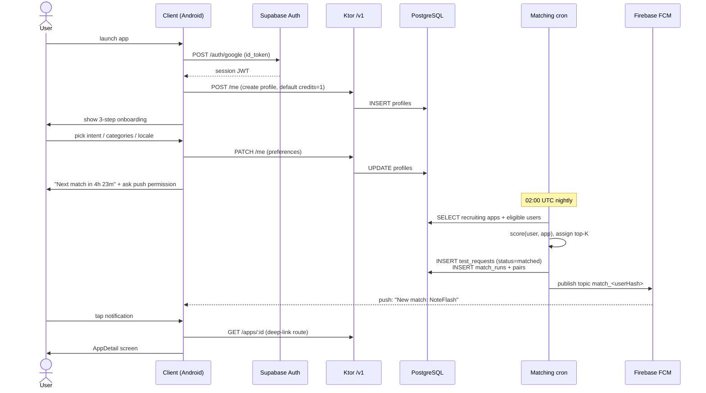
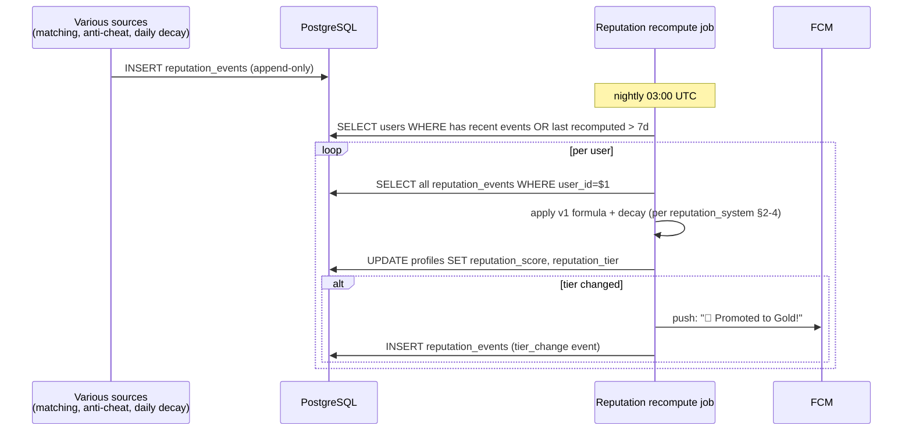

# AppTest — Testing Exchange End-to-End Flows

> **Version:** 0.1 · **Last updated:** 2026-05-19 · **Owner:** TBD
> 6 個 sequence diagrams cover V1 完整生命週期。對應 entity 見 `database_schema.md`，API 見 `api_contracts.md`，配對邏輯見 `ai_matchmaking.md`。

---

## F1. Onboarding → first match (24h)



## F2. Developer publishes app → first tester arrives

```mermaid
sequenceDiagram
    actor D as Developer
    participant C as Client
    participant API as Ktor /v1
    participant DB as PostgreSQL
    participant CRON as Matching cron
    actor T as Tester

    D->>C: open MyApps → "+"
    D->>C: fill form (package_name, name, desc, icon, play_url, requirements)
    C->>API: POST /apps (Idempotency-Key)
    API->>DB: validate play_url host + package_name unique<br/>DEDUCT credits (or 0 if 首 App)<br/>INSERT apps (status=recruiting)
    API-->>C: 201 created
    C->>D: navigate back to MyApps; show new App
    Note over CRON: 02:00 UTC + next day
    CRON->>DB: find App in candidate pool
    CRON->>DB: assign N matches up to min(remaining_slots, 4)
    Note over T: ...will install per F3...
    D->>C: pull-to-refresh MyApps
    C->>API: GET /apps/:id (own)
    API->>DB: SELECT app + current_testers count
    C->>D: "1/12 testers"
```

## F3. Tester joins → 14-day completion

```mermaid
sequenceDiagram
    actor T as Tester
    participant C as Client
    participant API as Ktor /v1
    participant DB as PostgreSQL
    participant PS as Play Store
    participant WM as WorkManager (local)
    participant CRON as Daily checks
    participant SVC as Reputation svc

    T->>C: tap matched App
    C->>T: AppDetail + Join CTA
    T->>C: tap "Join test"
    C->>API: POST /me/tests/:id/confirm-install (status hint)
    Note over C: Open Intent: VIEW play_opt_in_url
    C->>PS: redirect to Play Store opt-in
    T->>PS: accept opt-in, install App
    PS-->>T: App installed
    T->>C: return to AppTest
    C->>C: PackageManager.getPackageInfo(pkg) → true
    C->>API: POST /me/tests/:id/confirm-install (verified=true)
    API->>DB: UPDATE test_requests<br/>status=installed→active, installed_at=now
    C->>WM: schedule daily heartbeat (24h, idempotent per date_utc)
    loop daily × 14
        WM->>C: trigger; PackageManager check
        C->>API: POST /heartbeat
        API->>DB: UPSERT heartbeats; days_active++
    end
    CRON->>DB: days_active ≥ required_days → status=completed
    CRON->>SVC: emit ReputationEvent(test_completed, delta=+6~12)
    CRON->>FCM: push tester: "Test complete! +X rep"
    CRON->>DB: INSERT proofs (auto, signed)
```

## F4. Daily heartbeat lifecycle (lost / abandoned path)

```mermaid
sequenceDiagram
    participant WM as WorkManager
    participant C as Client
    participant API as Ktor /v1
    participant DB as PostgreSQL
    participant CRON as Heartbeat sweeper
    actor T as Tester
    participant FCM as FCM

    WM->>C: scheduled trigger
    C->>C: PackageManager.getPackageInfo(pkg)
    alt App still installed
        C->>API: POST /heartbeat (package_present=true)
        API->>DB: UPSERT heartbeats; days_active++
    else App uninstalled
        C->>C: show local notification "X removed"
        Note over CRON: every 6h sweeper
        CRON->>DB: SELECT test_requests WHERE last_heartbeat_at < now - 48h AND status=active
        CRON->>DB: UPDATE status=at_risk + insert warning event
        CRON->>FCM: push tester: "Re-install or it'll be marked abandoned"
        Note over CRON: 24h grace passes
        CRON->>DB: UPDATE status=abandoned, abandon_reason=heartbeat_lost
        CRON->>DB: emit ReputationEvent(test_abandoned, delta = -10~30)
    end
```

## F5. Reputation event → nightly recompute



## F6. Anti-cheat detection → moderation outcome

```mermaid
sequenceDiagram
    participant SRC as Heuristic jobs<br/>(sybil/bot/phantom)
    participant DB as PostgreSQL
    participant Q as Moderation queue
    actor MOD as Moderator
    actor U as Suspected user
    participant SVC as Penalty service
    participant FCM as FCM

    SRC->>DB: detect anomaly (per anti_cheat §3)
    SRC->>Q: INSERT report (auto, ≤72h SLA)
    MOD->>Q: pick → review evidence + timeline
    alt confirmed fraud
        MOD->>SVC: apply penalty
        SVC->>DB: ReputationEvent(fraud_flagged, -100); freeze credits 30d
        SVC->>FCM: push: warning + appeal link
    else false positive
        MOD->>DB: decision=false_positive (no-op on rep)
    else need more info
        MOD->>FCM: request evidence from U → re-review
    end
```

## 7. State machine (TestRequest) — short form

`matched → installed → active → completed` 主路徑。任意 active 階段 48h 無 heartbeat → `at_risk` → 24h grace → `abandoned`。Matched 階段使用者 48h 未 confirm → 直接 abandoned。完整詳見 F3/F4 sequence + `database_schema.md` §4。

## 8. Idempotency

詳見 `api_contracts.md §12`。本檔流程中所有 `POST /heartbeat` / `POST /apps` / `confirm-install` 皆套對應 idempotency 機制。

## 9. Open decisions

| ID | Decision | Status |
|---|---|---|
| APT-P-027 | at_risk grace period (24h vs 48h) | default 24h |
| APT-P-028 | Tier change notification timing (same recompute vs next day) | default: same recompute |
| APT-P-029 | Fraud penalty appealable window | default 30d post-decision |
