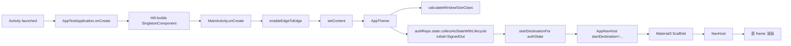
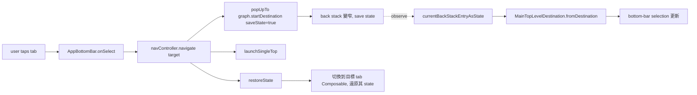
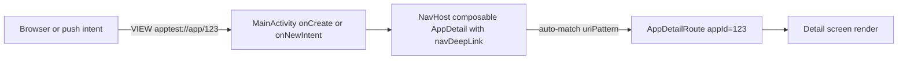
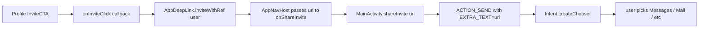

# :app — Internal Flow

> Cold start → first render → NavHost wiring → bottom-bar selection。

## Flow 1: Cold start to first frame

`initial = SignedOut` 表示第一個 frame 永遠先顯示 sign-in；當 SessionStore 讀到 session 後（< 100ms）`authState` flip → recompose 切到 MainRoot → redirect 到 Home。

## Flow 2: Bottom-bar tab switch

按返回鍵在任何 tab → 直接退出 app（startDestination 是 MainRoot/Home 為 back-stack 底）。

## Flow 3: Sign-out from Settings

```mermaid
flowchart LR
    S[Settings.SignOut tap] --> MA[MainActivity.signOut]
    MA --> LS[lifecycleScope.launch]
    LS --> AR[AuthRepository.signOut]
    AR -->|fake or real| SS[SessionStore.clear / FakeRepo emit]
    SS --> ST[AuthState.SignedOut emit]
    ST --> COL[MainActivity recomposes]
    COL --> SD[startDestinationFor → AuthRoot]
    SD --> NV[NavHost recomposes with new start]
    NV --> SR[SignInRedirect launchedEffect]
    SR --> SI[NavHost lands on SignIn]
```

注意：因為 startDestination 切換會重新建構 NavHost，當前 back-stack 被丟棄 — 這正是想要的（sign-out 應清狀態）。

## Flow 4: Deep-link entry from outside intent

`apptest://` 已 wired；`https://apptest.dev/` autoVerify=false 直到 `assetlinks.json` 上線（APT-OPS-001）。

Inbox 內部點擊也有 manual 路徑：`onItemDeepLink` 透過 `AppDeepLink.parse(Uri)` 轉 `AppDestination` 再 `navController.navigate(it)`。

## Flow 5: Share invite

Activity-only API — NavHost 不持 Context，靠 callback 上拋。

## Edge-to-edge insets contract

| Layer | What it handles | Why |
|---|---|---|
| `MainActivity.enableEdgeToEdge` | 系統 bar 完全透明 + status bar 配 dynamic color | per APT-Q-004 |
| Outer Scaffold (`contentWindowInsets = WindowInsets(0)`) | **不** 套 system bar padding | 避免與內部 feature ScreenScaffold 雙重 padding |
| `AppBottomBar` (M3 NavigationBar 內建) | 底部 nav bar inset | M3 預設行為 |
| Feature `ScreenScaffold` | status bar + IME inset | 每個 feature 自管 |

不對齊就會看到 content 被推到怪位置；改任何一層都要再驗 4 個 tab 都正常。
