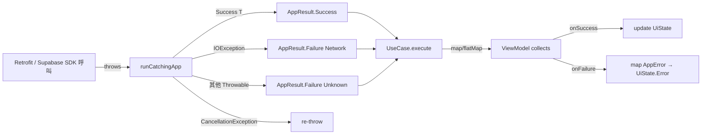
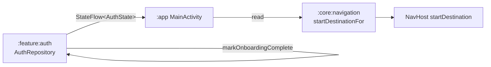
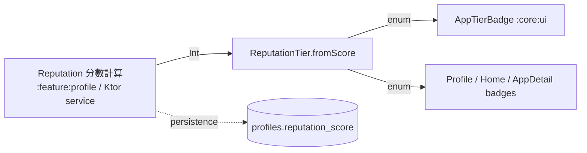
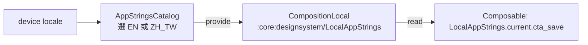

# :core:common — Internal Flow

> 本模組無業務流程（純 data + pure functions）。本文檔說明 `AppResult` / `AppError` 在跨層呼叫鏈中的流轉契約。

## Flow 1: Repository → UseCase → ViewModel 的 result 鏈

**契約：**
- 只有 adapter 邊界（Retrofit / SDK / DB）可以 `try { ... } catch`。Domain / VM 看到的永遠是 `AppResult`。
- `CancellationException` 一律重 throw — `runCatchingApp` 與 `UseCase` 都有處理。

## Flow 2: AuthState producer / consumer

`AuthState` 在 `:core:common` 而非 `:core:navigation` — 因為 `:core:domain/AuthRepository` 也要引用。放 navigation 會逼 domain 依賴 navigation（Android library），破層次。

## Flow 3: ReputationTier 雙向使用

Score 才是真相，tier 只是顯示。**不存 tier** — 每次顯示重算（cheap pure fn）。

## Flow 4: AppStrings 取用

`:core:common` 提供 data 與兩本 const catalog；Compose wrap 在 `:core:designsystem`（避免 `:core:common` 沾 Compose dep）。

## Error mapping cheatsheet

| 來源 | 變成什麼 |
|---|---|
| `IOException`（連線、timeout、DNS） | `AppError.Network` |
| Retrofit `HttpException 4xx/5xx` | `AppError.Http(code, message)` |
| Supabase Auth `AuthException` | `AppError.Auth(AuthReason.*)` |
| 欄位 input 驗證失敗 | `AppError.Validation(field, message)` |
| Resource 404 | `AppError.NotFound(resource)` |
| 已登入但 RLS 拒絕 | `AppError.Forbidden` |
| 409 衝突 | `AppError.Conflict` |
| 429 | `AppError.RateLimited(retryAfterSeconds)` |
| 其他 | `AppError.Unknown(cause = t)` |

新型錯誤先評估是否能套既有 case；無法套才加新 subtype（避免膨脹）。
