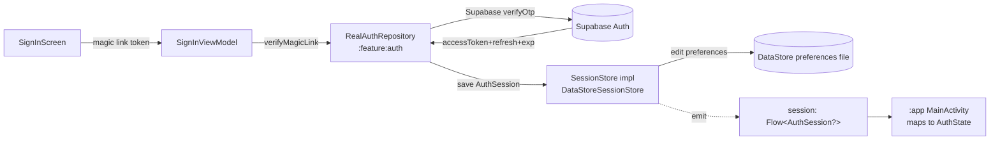
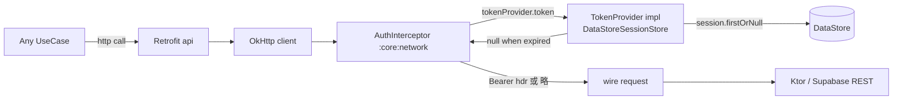
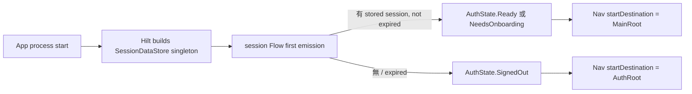

# :core:data — Internal Flow

> Auth session 讀寫 + token 注入路徑。

## Flow 1: Sign-in writes session



寫者唯一 = `:feature:auth/RealAuthRepository`（V1 = FakeAuthRepository 不會走這條，留作 R-043 切換用）。

## Flow 2: Network request attaches token



Token expired (server clock skew tolerated)：
- 不 attach header → server 回 401
- `:feature:auth` 監聽 401 → 觸發 refresh flow（用 refreshToken 換新 jwt）→ 寫回 SessionStore → caller 重試一次

## Flow 3: Sign-out clears session

```mermaid
flowchart LR
    UI[Settings: Sign out] -->|onSignOut| MA[MainActivity.signOut]
    MA -->|launch viewmodelScope| AR[AuthRepository.signOut]
    AR -->|Supabase auth signOut| SB[(Supabase)]
    AR -->|clear| SS[SessionStore.clear]
    SS -->|edit { it.clear }| DS[(DataStore)]
    SS -.emit null.-> FLOW[session Flow → null]
    FLOW --> MA2[MainActivity re-evals AuthState → SignedOut]
    MA2 --> NV[Navigate to AuthRoot]
```

`SessionStore.clear()` 是 idempotent — 重複呼叫無副作用，這對 `:feature:auth` 監測 401 後一律 clear 友善。

## Flow 4: App cold start restoration



注意：cold start 時 `session.firstOrNull()` 還沒回來前，MainActivity 已用 `initialValue = AuthState.SignedOut` 顯示 sign-in 1 frame，下個 recomposition 才換 Ready。這對 UX 影響極小（< 100ms）；若要消除可在 MainActivity 加 splash 直到 first emission。

## Threading

| Op | Dispatcher | 由誰決定 |
|---|---|---|
| DataStore read / write | IO (DataStore internal) | DataStore 預設 |
| `session.firstOrNull()` | caller's dispatcher | caller 注 dispatcher |
| `save()` / `clear()` 內部 | IO | 同上 |
| Interceptor `tokenProvider.token()` | OkHttp dispatcher pool | OkHttp 預設 |

不需手動 `withContext(io)` — DataStore 已切 IO。
