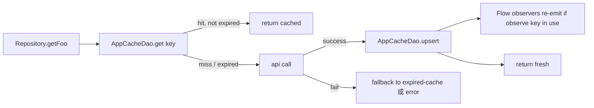
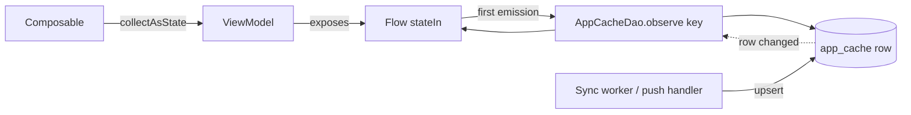
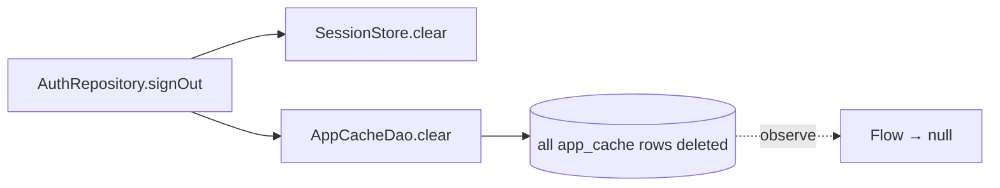
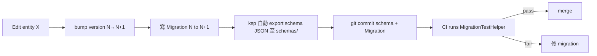

# :core:database — Internal Flow

> Cache 讀寫流 + migration 時機。

## Flow 1: Cache-aside read

TTL 由 caller 自決定。常見：5 min for fast-moving feed，1 day for slow-moving profile。

## Flow 2: Reactive observe

任何 write（HTTP refresh / push 觸發更新）走 `upsert(...)`，observer 自動拿到新值。**不** 在 ViewModel 端主動重 fetch — push 自身會 invalidate。

## Flow 3: Sign-out clears everything

V1 簡化：sign-out 把整個 client cache 砍掉。多帳號 V3 改 per-user partitioning。

## Flow 4: Schema migration (release path)

`MigrationTestHelper` (in `androidx.room:room-testing`) 把舊 schema JSON 跑一遍 migration，驗證資料完整性。

## TTL pattern reference

| 資料類型 | 建議 TTL | Why |
|---|---|---|
| Matched feed（home） | 5 min | 匹配 02:00 UTC 後高鮮，其餘時段穩定 |
| App detail | 10 min | 描述 / requirements 變動低 |
| User profile（own） | 沒 TTL，push invalidate | reputation 變動由 push 推 |
| Test requests | 30 sec | active 狀態變化快（heartbeat 影響） |

由 feature 端決定，本 module 不強制。

## 何時不該用 AppCacheEntry，改用 typed table

當以下任一條成立：
- 需要 SQL 查詢條件（如 `WHERE status = 'active' ORDER BY created_at`）
- 需要外鍵 / 關聯
- 需要 partial update（只改一個 field）
- 列表行數 > 1000，JSON blob 解析會卡

→ 新 `@Entity` + `@Dao`。
