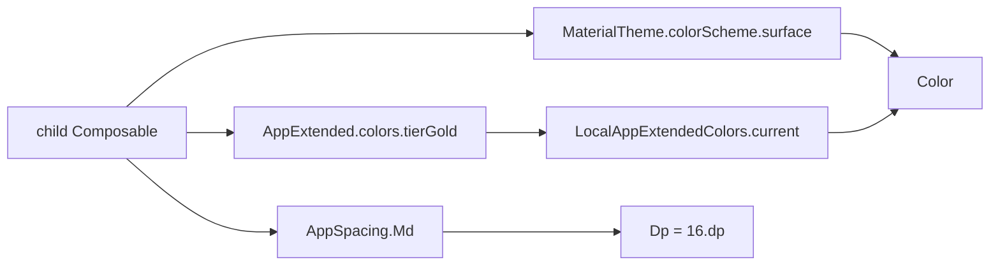

# :core:designsystem — Internal Flow

> Token 如何從定義 → 套用 → 在 `@Composable` 被讀到。

## Flow 1: AppTheme provisioning

```mermaid
flowchart LR
    A[:app MainActivity<br/>setContent { AppTheme { ... } }] --> B{darkTheme?<br/>isSystemInDarkTheme}
    A --> C{dynamicColor &&<br/>SDK >= 31?}
    B --> D[colorScheme]
    C --> D
    D --> M[MaterialTheme]
    B --> E[extended = AppExtendedDark<br/>or AppExtendedLight]
    E --> CL[CompositionLocalProvider<br/>LocalAppExtendedColors provides extended]
    CL --> M
    M --> CONTENT[content @Composable]
```

- `colorScheme` 選擇順序：dynamic dark/light → brand fallback dark/light
- `extended` 一定取 brand 版（dynamic 不影響 extended，因為 tier 顏色是品牌語意）
- M3 tokens (`MaterialTheme.colorScheme.*` / `.typography.*` / `.shapes.*`) 自動全 subtree 可讀

## Flow 2: Token resolution in a child Composable



- M3 tokens 走標準 CompositionLocal (`LocalContentColor`, `LocalTextStyle` 等)
- Extended tokens 走我們自己 `LocalAppExtendedColors`
- Spacing 是 object 常數，**不**走 CompositionLocal（不變值無需動態）

## Flow 3: Preview rendering

```mermaid
flowchart LR
    A[@Preview function] --> B[AppPreviewTheme]
    B --> C[AppTheme<br/>dynamicColor=false]
    C --> D[content with surface bg + 16dp padding]
```

- Preview **永遠** disable Dynamic Color (otherwise 隨開發機系統色變)
- 加 background + padding → IDE preview pane 邊緣不裁切

## State machine

無 — 本模組純 token，無 stateful 流程。
