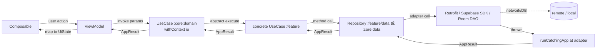
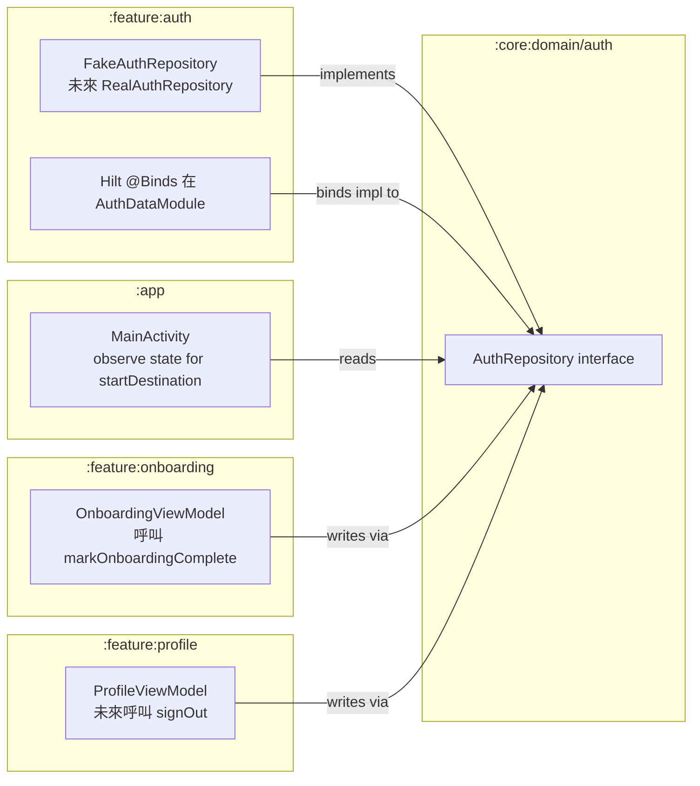
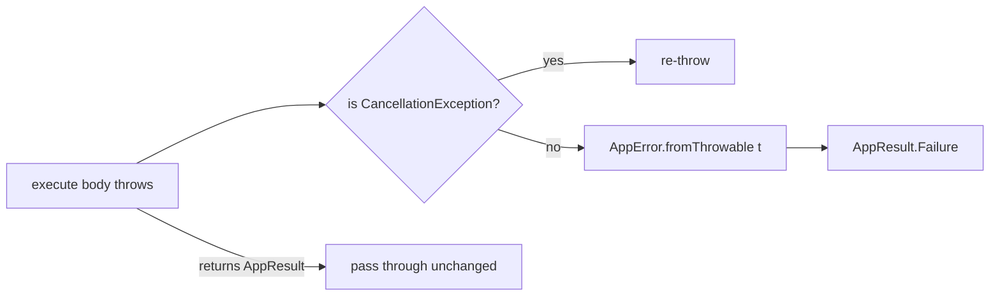
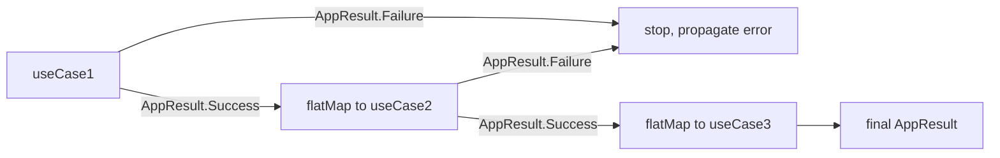
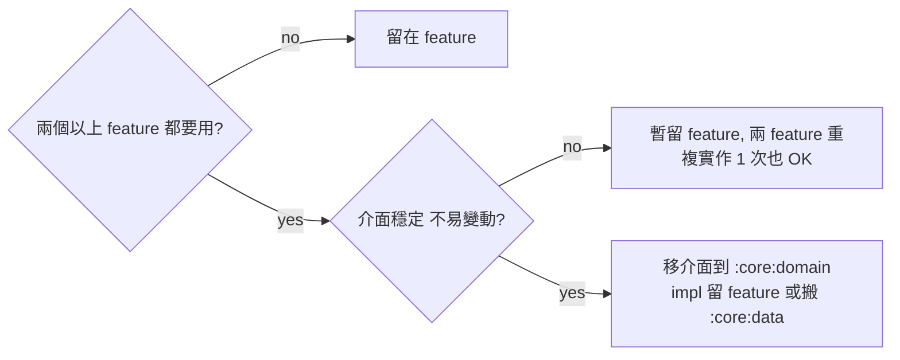

# :core:domain — Internal Flow

> 本模組無業務流程（只是 contract）。本文檔說明 UseCase / Repository 在跨層呼叫中的位置，以及 cross-feature contract 的 producer/consumer 拓樸。

## Flow 1: UI → UseCase → Repository → adapter

**關鍵契約：** UseCase base 已包 `withContext(io)`，concrete `execute` **不要** 再切 dispatcher（除非有 CPU-bound 計算需 `default`）。

## Flow 2: AuthRepository — cross-feature contract 拓樸

**Producer/Consumer 純粹：**
- 寫者唯一 — `:feature:auth`
- 讀者多 — `:app` / `:feature:onboarding` / `:feature:profile`
- 所有 module 都只看 `:core:domain` 介面，互不知道對方存在

無此中介層的話：`:feature:onboarding` 要存取 auth → 直接 import `:feature:auth` → 違反 hard rule (no feature-to-feature dep)。

## Flow 3: UseCase 內部 error 流

Concrete UseCase 內部 **可以** 直接 throw（被 base catch），但慣例上：
- Adapter 邊界以內回 `AppResult` — clean
- 只有真正不可預期的 NPE / IllegalState 才會 propagate 到 throw path

## Sequencing pattern: 多 use case 鏈接

VM 內部用 `flatMap` 鏈接，**不要** 把多個 use case 塞同一個。一 use case = 一 user-facing action（per UseCase.kt KDoc）。

## 何時把 feature-local repository 移到 :core:domain

YAGNI：**重複一次都好過早期抽象錯方向**。第三個 feature 要用時再考慮搬。
