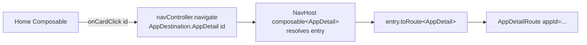
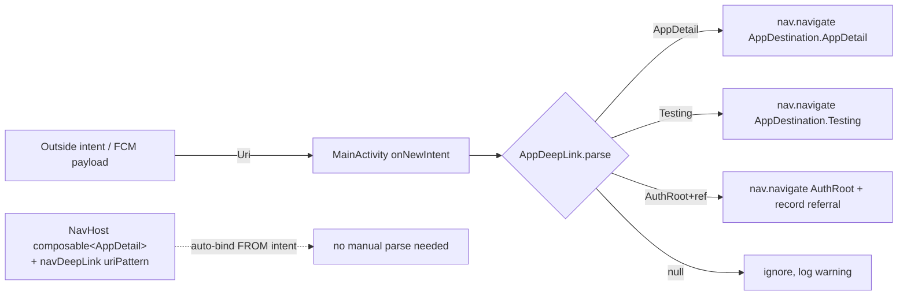
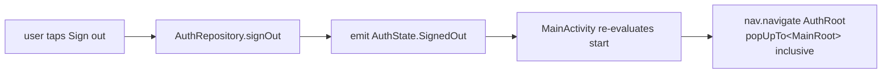
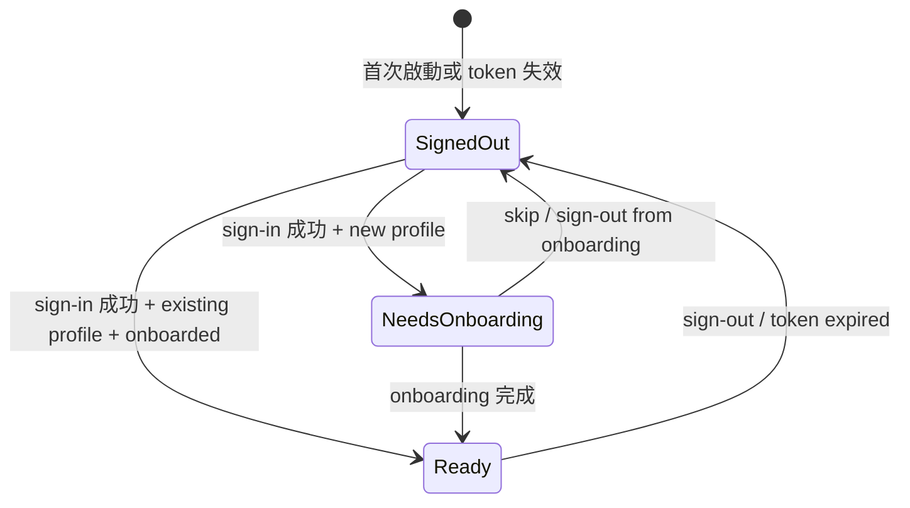

# :core:navigation — Internal Flow

> NavHost startDestination 決策 + deep-link 解析 + 跨 feature 跳轉的 wiring。

## Flow 1: Auth-gated start destination

```mermaid
flowchart LR
    A[:feature:auth<br/>AuthRepository] -->|Flow&lt;AuthState&gt;| B[:app MainActivity]
    B --> R[remember(authState)]
    R --> F[startDestinationFor]
    F -->|SignedOut| AR[AppDestination.AuthRoot]
    F -->|NeedsOnboarding| OR[AppDestination.OnboardingRoot]
    F -->|Ready| MR[AppDestination.MainRoot]
    AR --> NH[NavHost startDestination]
    OR --> NH
    MR --> NH
```

`startDestinationFor` 是 pure 函數，可放在 `remember(authState) { ... }` 內不引發無限重組。

## Flow 2: Cross-feature navigation (type-safe)



每個 feature 在自己 `nav/` 包提供 `NavGraphBuilder.<feature>Graph(navController)`；本 module 不提供 helper（Compose Nav 2.8+ 內建 `composable<T>` 已足夠）。

## Flow 3: Deep-link routing



兩條路徑：
- **Auto-binding** (`navDeepLink { uriPattern = AppDeepLink.PATTERN_APP_DETAIL_* }` in composable) — Compose Nav 自動接住外部 intent，無需 parse 程式碼
- **Manual parse** (`AppDeepLink.parse(uri)`) — 只在 push payload / 自家程式碼從非 nav 來源拿到 URI 時用

## Flow 4: Sign-out / state-reset



Sign-out 不只切換 state — 同步 popBackStack to clear 主畫面歷史，避免按返回鍵回到登入後狀態。

## State machine (AuthState)



3 states × 受限 transitions。`:feature:auth` 負責所有寫；`:app` 只讀。
