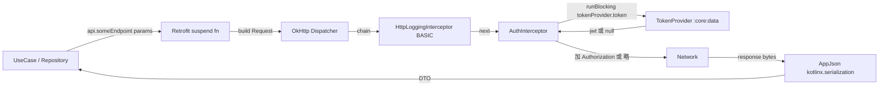
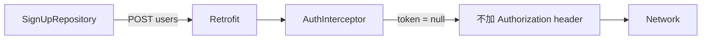
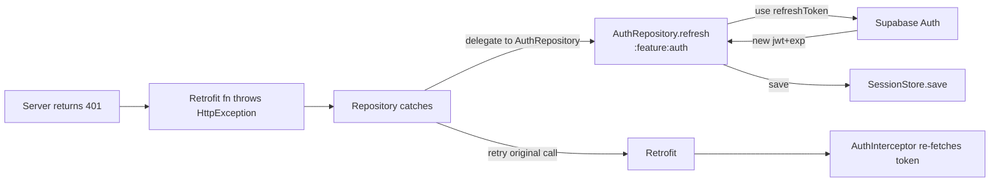
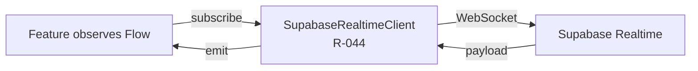

# :core:network — Internal Flow

> 一個 HTTP request 從 feature UseCase 到 server 的 wire flow，與 token 注入時機。

## Flow 1: Authenticated REST request

## Flow 2: Anonymous request（如 sign-up 端點）

`TokenProvider.token()` 回 null 時，request 仍可送出 — 由 server 端決定哪些 endpoint 允許匿名。

## Flow 3: 401 reaction（refresh — owned by :feature:auth）

**不** 在 `AuthInterceptor` 做 refresh — interceptor 沒有業務狀態（401 ≠ 一定要 refresh，例如 RLS 拒絕也是 401）。Repository / `:feature:auth` 才有正確上下文。

## Flow 4: Realtime（**不** 經本 module — 由 Supabase Kotlin SDK 處理）

註：Supabase Kotlin SDK 本身會用其內部 OkHttp instance；不與本 module 共用。Token 同樣從 `TokenProvider` 拿（R-044 wire）。

## Connection pool

| 設定 | 值 | Why |
|---|---|---|
| `connectTimeout` | 20s | 配合 Cloud Run 冷啟動 |
| `readTimeout` | 20s | 配合 matching cron 同步路徑 latency budget |
| `writeTimeout` | 20s | 上傳 icon 暫不走此 module（Storage SDK 處理） |
| Connection pool 大小 | OkHttp 預設（5） | V1 並發低，不調 |
| HTTP/2 | OkHttp 預設 enabled | — |

調整以上常數 → 改 `ApiConfig`，不在 Module 內 hardcode。

## 安全注意

- `HttpLoggingInterceptor` 級別 = **BASIC**（只印 method/path/code），永遠 **不** 升到 BODY 或 HEADERS — Authorization header + JSON body 都含 PII。
- Debug build 也維持 BASIC — 走 Charles / mitmproxy 才看 body，本 app 不主動印。
- TLS pinning：V1 不做（管理成本 > 收益）；如金鑰外洩風險升高再評估。
