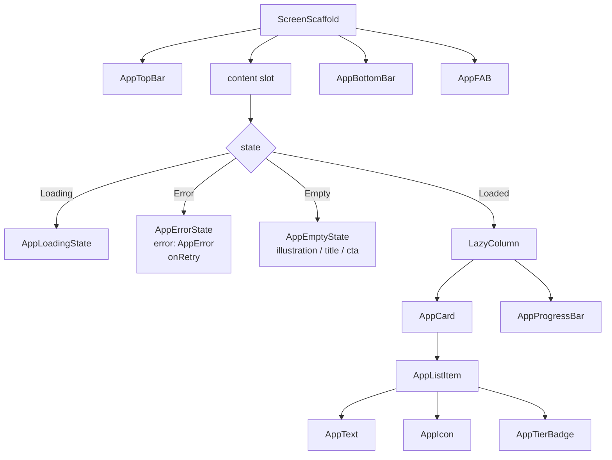
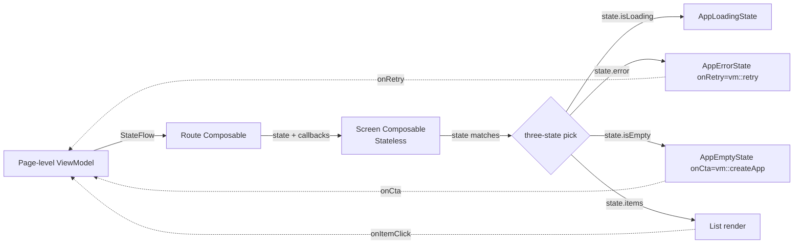
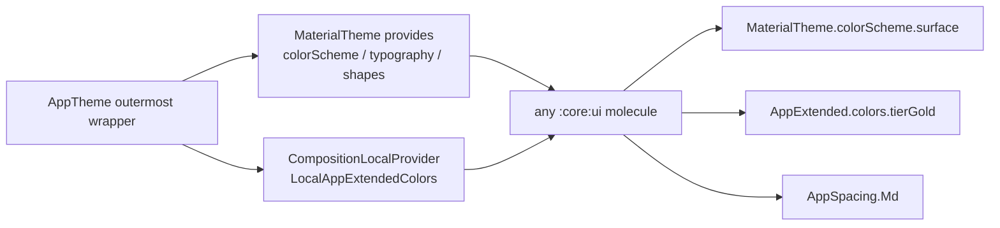
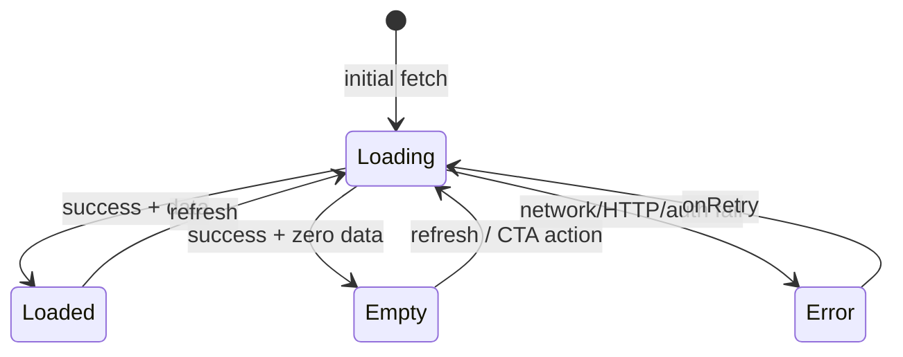

# :core:ui — Internal Flow

> 元件如何被組合 + state 如何被外界 hoist 進來 + 跨組件之間的合作關係。

## Flow 1: Atomic composition (一個 list-feed screen)

組合層次：Templates → Organisms → Molecules → Atoms (:core:designsystem)。

## Flow 2: State hoisting (organism 永不持業務 state)

**Hard rule:** organism / molecule **不**自己持業務 state；只接 state + callbacks。
UI-only state (expanded/collapsed / focused) 允許自己 `remember { mutableStateOf(...) }`。

## Flow 3: Theme token resolution

Spacing 不走 CompositionLocal（不變值，直接 object reference）。其他 tokens 全靠 wrapper provider。

## Flow 4: Three-state contract (per AppEmptyState / AppErrorState / AppLoadingState)

Page-level ViewModel 決定 which state; UI 只 render。沒有 4th state（如 "stale" / "offline" — 那些併入 Loaded with metadata）。
