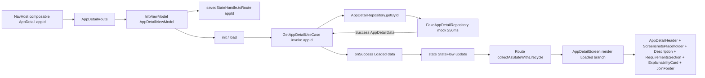
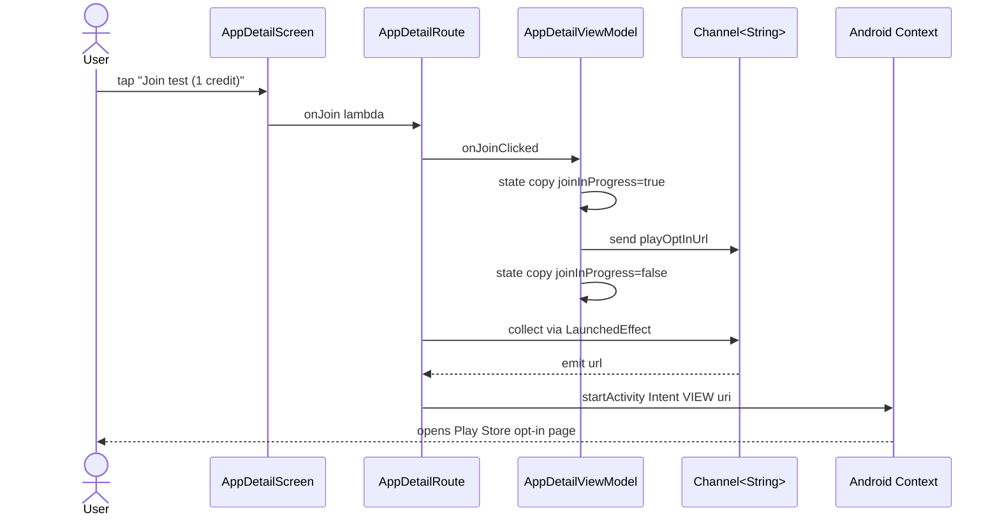
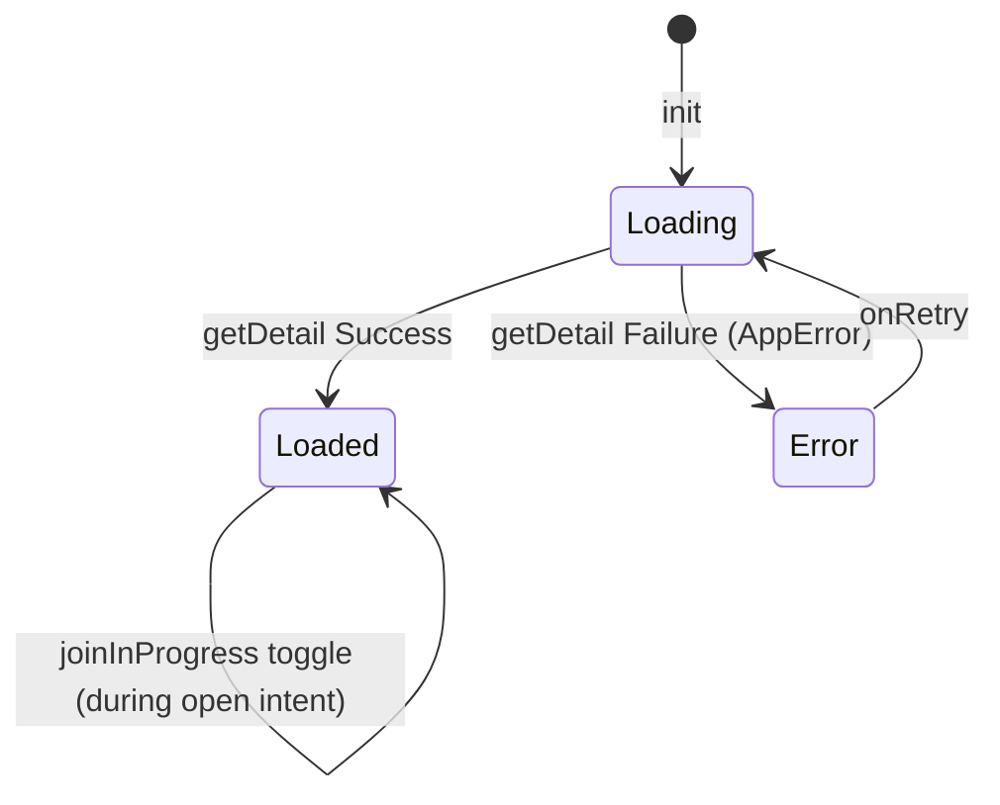
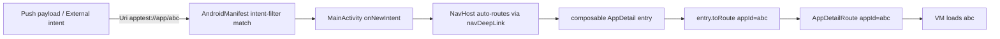
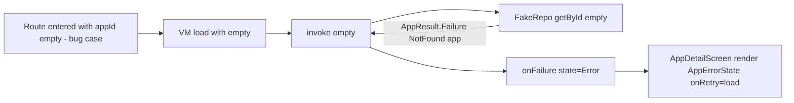

# :feature:appdetail — Internal Flow

> Load → render → Join CTA → 開 Play Store 路徑。Side-effect 走 Channel 而非 Composition。

## Flow 1: Initial load (from Home tap or deep link)

## Flow 2: Join CTA → open Play Store

**Why Channel not StateFlow?** Channel is one-shot — re-collecting after recompose doesn't re-fire.
Avoids accidentally re-opening Play Store on rotation.

## Flow 3: Three-state branching

`joinInProgress` 是 Loaded 內部 boolean，不另開 state — 鈕變 loading 樣式即可。

## Flow 4: Deep link arrival

設定在 `nav/AppDetailNavGraph.kt` 而非 :app — caller 不需知道 deep-link 細節。

## Flow 5: Empty-id error path

Real backend should never send empty id; this guard is defense in depth.
