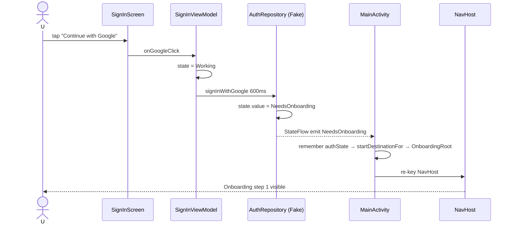
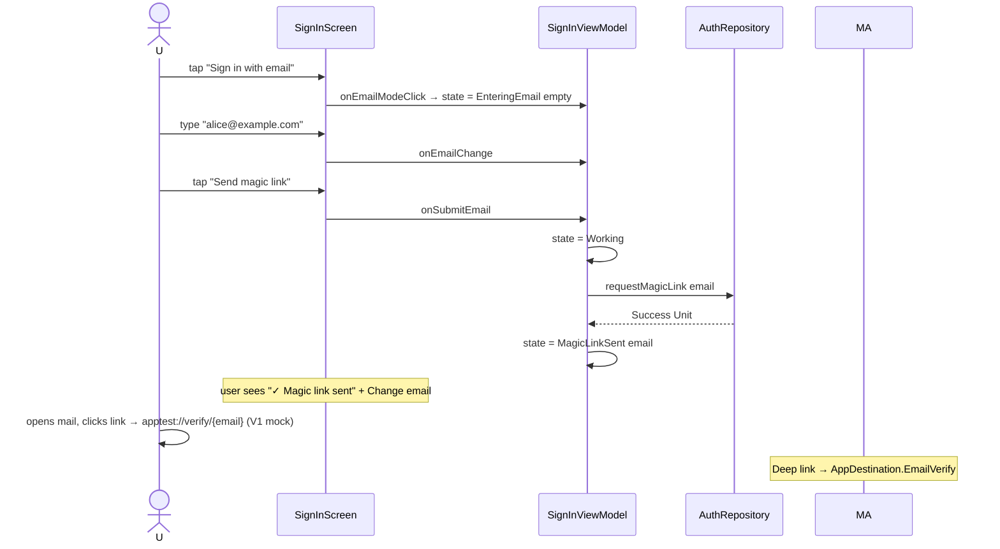
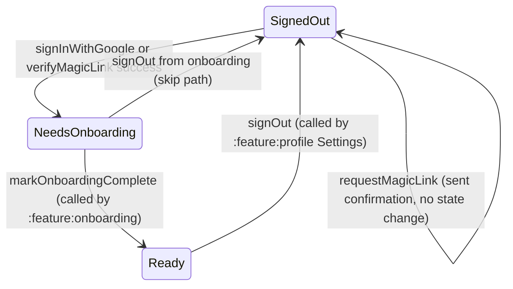

# :feature:auth — Flow

## Flow 1: Google sign-in path



## Flow 2: Email magic link path



## Flow 3: EmailVerify (deep-link arrival)

```mermaid
flowchart LR
    DL[Deep link apptest://verify/email] --> NH[NavHost composable EmailVerify]
    NH --> R[EmailVerifyRoute]
    R --> VM[EmailVerifyViewModel]
    VM --> AR[authRepo.verifyMagicLink token=email]
    AR --> SF[state.value = NeedsOnboarding]
    SF -.->|StateFlow| MA[MainActivity re-keys NavHost]
    MA --> OB[OnboardingRoot]
    VM --> SU[state = Succeeded]
    SU --> R2[UI shows "Signed in! Loading…"]
```

## Flow 4: AuthState lifecycle (full)


