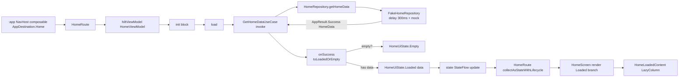
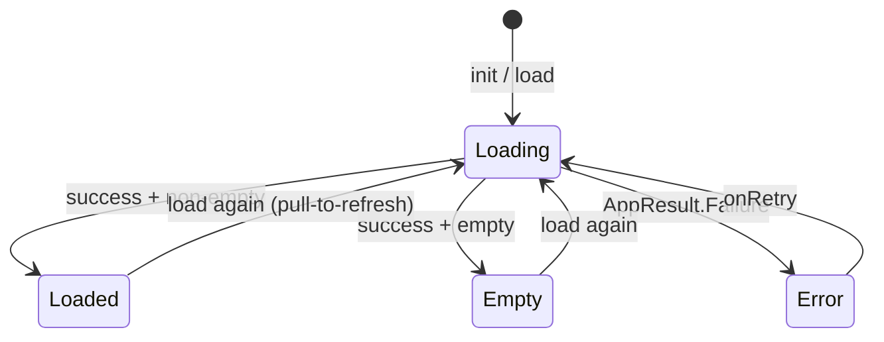
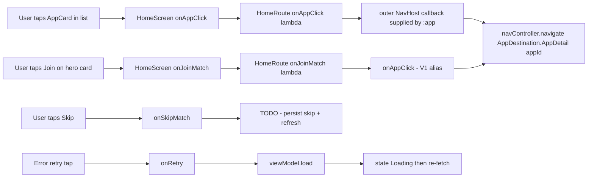
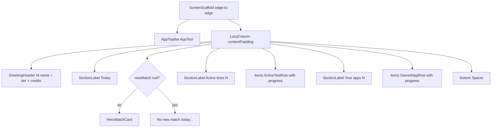

# :feature:home — Internal Flow

> Composition / state / 跳轉的全鏈路。

## Flow 1: First render

## Flow 2: State machine (HomeUiState)

僅 4 個 state。`HomeScreen.when (state)` 對 sealed 編譯器強制 exhaustive — 漏寫 branch = build 失敗（無 fallback warning）。

## Flow 3: User actions

## Flow 4: Loaded screen structure (visual hierarchy)

## Flow 5: When real backend lands (post-APT-V1-R-040)

替換策略：
1. 新 impl `RealHomeRepository @Inject constructor(api: AppTestApi, db: AppDatabase) : HomeRepository`
2. `HomeDataModule.kt` 改 `@Binds bindHomeRepository(impl: RealHomeRepository): HomeRepository`
3. 移除（或保留作 test fixture）`FakeHomeRepository`
4. UI / VM / UseCase / Route — **完全不動**（Clean Architecture 紅利）

驗證：`./gradlew :feature:home:assembleDebug` + 跑既有 unit test 應全綠。
