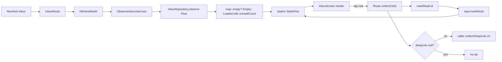

# :feature:inbox — Flow

## Flow 1: List + mark-read

## Flow 2: Mark-all-read action
TopBar action visible only when `unreadCount > 0`. Tap → `markAllRead()` → repo mutates Flow → UI auto-refresh (rows lose unread dot opacity).
