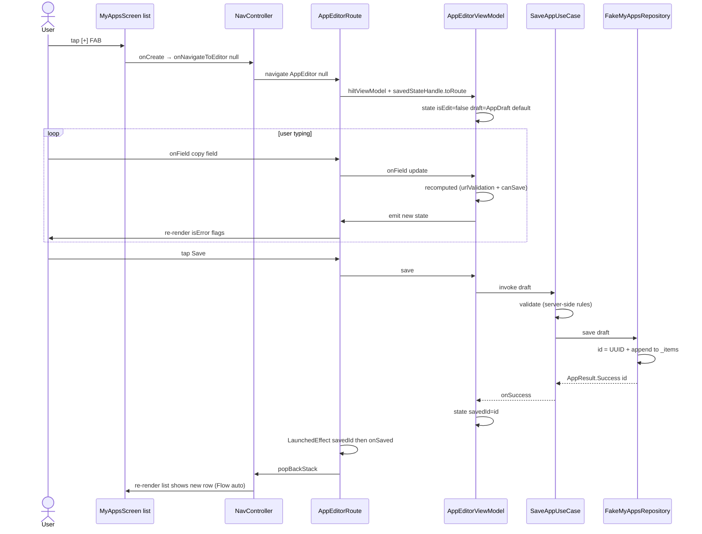
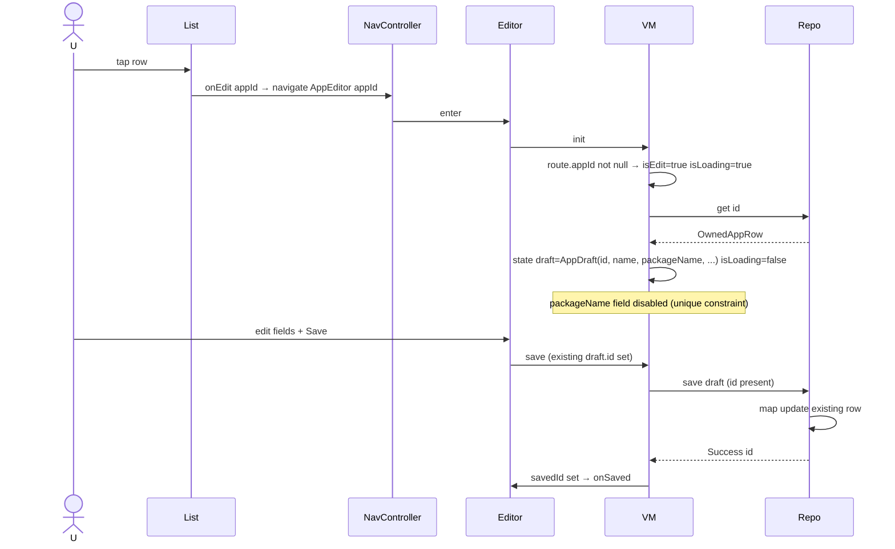
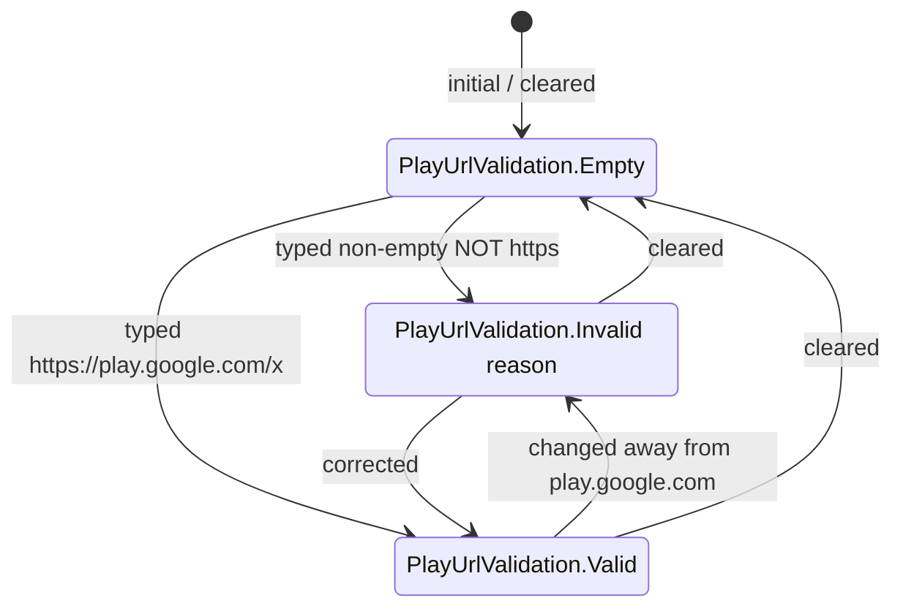

# :feature:myapps — Internal Flow

> List ↔ Editor 同步、Editor validation、Save 路徑。

## Flow 1: List render with live updates

```mermaid
flowchart LR
    NH[NavHost composable AppDestination.MyApps] --> MAR[MyAppsRoute]
    MAR --> VM[hiltViewModel MyAppsViewModel]
    VM --> UC[GetMyAppsUseCase invoke]
    UC --> REPO[MyAppsRepository.observe]
    REPO --> FAKE[FakeMyAppsRepository<br/>MutableStateFlow seed]
    FAKE -->|Flow List| MAP[map: items.isEmpty? Empty : Loaded]
    MAP --> SF[stateIn WhileSubscribed]
    SF --> MAS[MyAppsScreen state]
```

`stateIn(WhileSubscribed(5_000))` 讓 ViewModel 在無 collector 時釋放 upstream；rotation 內
不重新 collect（5s 緩衝）。

## Flow 2: Create flow

## Flow 3: Edit flow

## Flow 4: Play URL validation (per keystroke)

實作在 `PlayOptInUrlValidator.kt`（pure object）。VM `recomputed()` 每次 onField 都呼叫。

## Flow 5: Save validation cascade

Two layers of validation:
1. **UI live** (`AppEditorViewModel.recomputed`) — drives `canSave` button enabled state
2. **Final-shot** (`SaveAppUseCase.validate`) — re-checks all rules before repo call; returns
   `AppError.Validation(field, message)` if any fail. Never trust UI alone.

If validation fails server-side (post-real-backend) → `AppResult.Failure(AppError)` → `saveError`
shown above action row.

## State machine: AppEditorUiState

Single mutable shape (not sealed) — form always visible. Flags toggle behaviour:
- `isLoading` (initial edit fetch only)
- `isSaving` (during save call)
- `savedId != null` (signal to navigate up via `LaunchedEffect`)
- `loadError` / `saveError` (banner / inline)
- `canSave` (derived; not user-settable)
