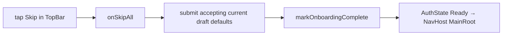

# :feature:onboarding — Flow

## Flow 1: 3-step wizard + submit

```mermaid
sequenceDiagram
    actor U
    participant S as OnboardingScreen
    participant VM
    participant AR as AuthRepository (from :core:domain)
    participant MA as MainActivity

    Note over S: state.currentStep = 1, default intent = TestOthers
    U->>S: tap Continue
    S->>VM: onNext
    VM->>VM: state.currentStep = 2
    U->>S: tap Productivity chip
    S->>VM: onCategoryToggle "Productivity"
    VM->>VM: draft.categories += "Productivity"; canProceed = true
    U->>S: tap Continue
    S->>VM: onNext
    VM->>VM: state.currentStep = 3
    Note over S: Step 3: language pre-selected "en"
    U->>S: tap Done
    S->>VM: onNext (isLastStep)
    VM->>VM: state.isSubmitting = true
    VM->>AR: markOnboardingComplete
    AR->>AR: state.value = Ready
    AR-->>MA: StateFlow emit Ready
    MA->>MA: startDestinationFor → MainRoot
    Note over S: Screen pops as NavHost re-keys
```

## Flow 2: Skip path



V1 fake `markOnboardingComplete` always succeeds. Real impl may validate server-side and
return `AppError` → shown as banner above bottom actions.

## Flow 3: Back navigation

`onBack` decrements currentStep min 1. Step 1 Back has no effect (Back button hidden).
System back gesture also goes through Compose Nav's default → cancels whole subgraph if at root.
