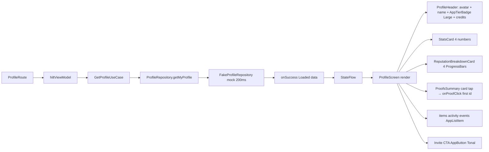

# :feature:profile — Flow

## Flow 1: render

## Flow 2: TopBar actions
- Inbox icon → caller `onInboxClick` → `nav.navigate(AppDestination.Inbox)`
- Settings icon → caller `onSettingsClick` → `nav.navigate(AppDestination.Settings)`
- Invite CTA → caller `onInviteClick` → V1 stub (V2 share sheet with referral code)
