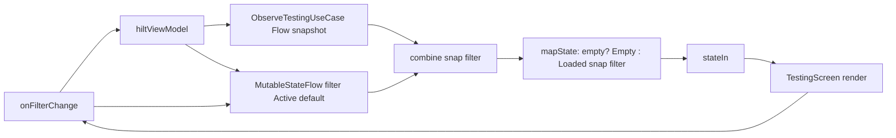
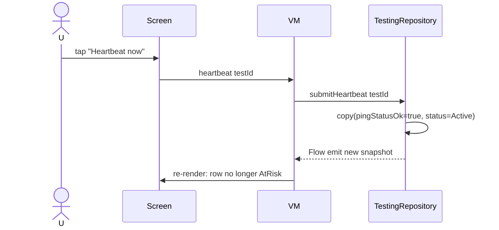

# :feature:testing — Flow

## Flow 1: render + filter

## Flow 2: AtRisk → Heartbeat-now

## Flow 3: Abandon (with caution)

V1 直接呼叫 `repo.abandon(testId)` — 從 list 移除。V2 應加 confirmation dialog +
reputation penalty preview (per `reputation_system.md §6`).
